# medagent-core

> **⚠️ RESEARCH USE ONLY — NOT FDA-cleared — NOT for clinical deployment**

**Auditable biomedical AI decision support agent** — multi-hop clinical reasoning, drug interaction detection, and safety-first agentic architecture for health-AI research.

<p align="left">
  <a href="https://github.com/Francis1998/medagent-core/actions/workflows/ci.yml"></a>
  <a href="https://www.python.org/downloads/"></a>
  <a href="LICENSE"></a>
  <a href="#quality-gates"></a>
  <a href="#quality-gates"></a>
  <a href="#quality-gates"></a>
  <a href="#quality-gates"></a>
  <a href="SAFETY.md"></a>
  <a href="#live-demos"></a>
</p>

---

## Live Demos

**Clinical reasoning pipeline — STEMI chest pain case:**


**Drug interaction screening — warfarin + amiodarone polypharmacy:**


**ESCALATE trigger — ambiguous B-symptoms, confidence 0.38 < 0.60:**



**Multi-LLM routing — GPT-5.5, Claude, Gemini, and Kimi failover:**


**FHIR intake — raw PII redaction before model calls:**



**Finite-state machine — inspectable state transitions:**


**Evaluation harness — MedQA-style and drug-interaction regression checks:**


**Audit trace — replayable session history with hashed inputs:**



Run all three locally — no API keys needed:
```bash
git clone https://github.com/Francis1998/medagent-core
cd medagent-core && pip install -e ".[dev]"
python scripts/demo.py --case all
```

---

## The Problem

Clinical AI is broken in a predictable way. Most LLM-wrapper "pipelines" used in health-AI research today:

- Feed patient data into `generate()` and return raw text — **no audit trail, no intermediate state**
- Cannot explain *why* they reached a conclusion — **no evidence chain**
- Surface drug interaction warnings from a single database — **one-source = unvalidated**
- Never say "I don't know" — **no confidence calibration, no escalation**
- Log patient names and MRNs to LLM APIs in plain text — **PII leakage**
- Wrap everything in a `try/except` and call it production — **no safety enforcement**

The result: every health-AI team re-invents the same safety plumbing for months before they can test a single hypothesis. And every team makes the same mistakes.

`medagent-core` is the production-grade, open-source reference implementation that solves these problems — auditably, testably, and without black-box magic.

---

## Use Cases

### 1. Emergency Department Triage Research

**The problem:** ED physicians see 150+ patients per shift. High-acuity presentations require fast differential generation, but cognitive load causes anchoring errors — the first plausible diagnosis becomes the only one considered.

**How medagent-core helps:**
- Ingests triage FHIR data (vitals, chief complaint, prior diagnoses, meds) in under 2 seconds
- Runs biomedical NER to extract symptoms, medications, and lab values simultaneously
- Queries PubMed for top relevant papers on each candidate diagnosis
- Returns a ranked differential with explicit evidence FOR and AGAINST each hypothesis
- If confidence < 0.6 → automatically flags for senior physician review (ESCALATE)

```
Input:  65M, chest pain radiating to left arm, Troponin-I 2.4 ng/mL, ST elevation II/III/aVF
Output: #1 STEMI Inferior (0.89) · #2 NSTEMI (0.61) · #3 Aortic Dissection (0.34)
        Drug interaction: aspirin + metoprolol → MODERATE bradycardia [2 sources]
        → Recommend: immediate cardiology consult · primary PCI evaluation
```

**Research angle:** Study whether AI-assisted triage reduces time-to-diagnosis or anchoring errors in retrospective ED datasets.

---

### 2. Polypharmacy Safety — Automatic Interaction Screening

**The problem:** The average 65+ patient takes 5+ medications. Drug-drug interactions cause ~125,000 deaths per year in the US. Manual review is impractical at scale; existing tools surface too many false positives because they check only one database.

**How medagent-core helps:**
- Queries **both** RxNorm Interaction API **and** OpenFDA drug labels simultaneously
- Only surfaces a warning when **both sources independently confirm** the interaction
- Classifies severity: CRITICAL / HIGH / MODERATE / LOW with mechanism and clinical consequence
- Source attribution enables pharmacist verification before any clinical action

```python
# Real case: warfarin + amiodarone co-prescription
POST /drug-interactions
{ "medications": ["warfarin 5mg", "amiodarone 200mg", "aspirin 81mg", "omeprazole 20mg"] }

→ CRITICAL: warfarin + amiodarone — CYP2C9 inhibition → 3-5× INR elevation
            → VALIDATED ✓ (rxnorm + openfda)
→ MODERATE: warfarin + aspirin — additive anticoagulation + GI mucosal damage
→ MODERATE: omeprazole + warfarin — CYP2C19 inhibition, modest INR increase
```

**Research angle:** Benchmark false positive/negative rates vs DrugBank ground truth using the included `scripts/eval_drugbank.py`.

---

### 3. Clinical AI Reliability Benchmarking

**The problem:** The research community lacks a reproducible, open framework for measuring how well LLMs perform clinical reasoning — and critically, *where* they fail. Published papers benchmark on USMLE but omit prompting strategy, confidence calibration, and failure mode analysis.

**How medagent-core helps:**
- `scripts/eval_medqa.py` runs the full agent pipeline on MedQA USMLE-style questions
- Logs per-question reasoning traces (not just accuracy) enabling qualitative failure analysis
- Compares reasoning quality across Claude, GPT-5.5, Gemini, and Kimi with identical prompts
- Bayesian confidence score measures calibration: does high confidence correlate with correctness?
- ESCALATE events reveal what the model *doesn't know* — the most clinically important failure mode

```bash
# Compare GPT-5.5 vs Claude on USMLE-style questions:
ANTHROPIC_API_KEY=sk-ant-... python scripts/eval_medqa.py --max-samples 100
OPENAI_API_KEY=sk-...       python scripts/eval_medqa.py --max-samples 100
# Results in results/medqa_eval.json for side-by-side comparison
```

---

### 4. Drug Discovery — Literature Mining and Evidence Synthesis

**The problem:** Biomedical researchers need to synthesise evidence across hundreds of PubMed papers when evaluating a drug candidate or mechanism. Manual review takes weeks; generic RAG pipelines lack biomedical domain awareness and can't construct explicit evidence chains.

**How medagent-core helps:**
- Extracts MeSH terms from clinical entities using scispaCy NER (not keyword search)
- Queries PubMed ESearch/EFetch with structured MeSH queries for higher precision
- Hybrid BM25 + dense retrieval over an ingested local corpus of abstracts
- Evidence chain builder annotates which retrieved papers support each hypothesis with strength scores
- All evidence is source-attributed for direct citation

```bash
# Ingest PubMed abstracts on a target mechanism:
python scripts/ingest_kb.py \
  --pubmed-terms "KRAS G12C inhibitor" "sotorasib resistance" "MAPK pathway" \
  --max-per-term 50

# Query the agent for an evidence synthesis:
POST /analyze
{ "query": "What is the evidence for sotorasib resistance mechanisms in KRAS G12C NSCLC?" }
```

---

### 5. Health-AI Pipeline Development — Reference Architecture

**The problem:** Every health-AI engineering team rebuilds the same safety infrastructure from scratch: PII de-identification, LLM fallback chains, output validation, audit logging, confidence gating. This is months of work done repeatedly with inconsistent safety guarantees.

**How medagent-core helps — use it as your starting point:**

```python
# Add a new LLM provider in ~50 lines:
class MyProviderAdapter(BaseLLMAdapter):
    @property
    def provider_name(self) -> str: return "myprovider"
    async def complete(self, prompt: str, **kwargs: Any) -> LLMResponse: ...
# Register it → automatically joins the medical routing fallback chain

# Add a new retrieval source:
async def search(entities: list[ClinicalEntity]) -> list[RetrievedDocument]: ...
# Add to RetrievalOrchestrator → runs in parallel with PubMed + local KB
```

All safety infrastructure (PII hashing, disclaimer injection, dual-source drug validation, ESCALATE gating) is production-hardened and covered by 93 unit tests. You inherit it for free.

---

### 6. AI Safety Research in High-Stakes Domains

**The problem:** AI safety researchers studying failure modes in high-stakes applications need realistic, instrumented systems where agent behaviour can be inspected, modified, and adversarially tested. Most clinical AI is closed-source.

**How medagent-core helps:**
- The ESCALATE mechanism is a novel studied safety pattern: what triggers it, what happens after, and whether it correctly identifies genuine uncertainty — all observable
- Every state transition, confidence score, evidence item, and uncertainty flag is persisted to the audit log
- Jailbreak and scope-violation detection in `ScopeEnforcer` can be extended and stress-tested
- HMAC-SHA256 PII hashing with configurable salts enables privacy-preserving research on real cohort data
- Adversarial prompt handling is isolated to `safety/scope_enforcer.py` with explicit test coverage

**Research angle:** Study the conditions under which the ESCALATE gate fails, measure confidence calibration under distribution shift, or evaluate jailbreak resistance against biomedical adversarial prompts.

---

### 7. Medical Education — Explicit Differential Reasoning

**The problem:** Medical students learning clinical reasoning struggle to understand *why* a diagnosis is ranked above another. The reasoning chain is implicit in a clinician's head. AI-generated explicit differential reasoning chains could be a novel educational resource.

**How medagent-core helps:**
- Returns ranked hypotheses with evidence FOR and AGAINST each — the exact structure used in clinical case discussions
- Uncertainty flags teach the "know what you don't know" principle
- ESCALATE trigger illustrates the critical skill of recognising diagnostic limits
- Eval scripts support USMLE-style case analysis at scale for curriculum development

```bash
# Test on a clinical case:
python scripts/demo.py --case escalate
# Shows a case where the agent correctly recognises it cannot determine the diagnosis
# and explicitly refuses to produce a recommendation — the right clinical behaviour
```

---

## Architecture — Observe → Decide → Act

```
┌──────────────────────────────────────────────────────────────────────┐
│  POST /analyze (FHIR patient context + clinical query)               │
└────────────────────────────┬─────────────────────────────────────────┘
                             │
         ┌───────────────────▼────────────────────────┐
         │        ClinicalAgentStateMachine            │
         │                                             │
         │  INTAKE ──► ENTITY_EXTRACTION               │
         │                    │                        │
         │          KNOWLEDGE_RETRIEVAL                │
         │         /     │           \                 │
         │      PubMed  RxNorm+FDA  LocalKB            │
         │      (async) (async)     (async)            │
         │         \     │           /                 │
         │           REASONING (LLM)                   │
         │                │                            │
         │          SAFETY_CHECK                       │
         │         /              \                    │
         │     OUTPUT          ESCALATE                │
         │   conf ≥ 0.6       conf < 0.6 OR            │
         │                    contradictions            │
         └─────────────────────────────────────────────┘
                             │
                     audit_log.db (every run, immutable)
```

| Stage | Component | Timeout |
|---|---|---|
| **INTAKE** | `ScopeEnforcer` + PII hashing | — |
| **ENTITY_EXTRACTION** | `EntityExtractor` (scispaCy NER + regex fallback) | 10s |
| **KNOWLEDGE_RETRIEVAL** | `RetrievalOrchestrator` (parallel fan-out) | 20s/source |
| **REASONING** | `ReasoningEngine` + `MedicalRouter` | 90s |
| **SAFETY_CHECK** | Confidence gate + contradiction detection | — |
| **OUTPUT / ESCALATE** | `ClinicalReasoning` + mandatory disclaimer | — |

---

## Safety — Nine Hard Controls

All controls are **technically enforced in code**, not just documented policy:

| # | Control | Where enforced | What it does |
|---|---|---|---|
| 1 | Mandatory disclaimer | `models.py` | Injected at construction time — cannot be overridden via API |
| 2 | Medical system prompt | `safety/disclaimer.py` | Prohibits prescriptions, internet, code execution |
| 3 | Output validation | `llm/validator.py` | Rejects prescription language before returning |
| 4 | ESCALATE gate | `agent/state_machine.py` | Auto-escalates when confidence < threshold |
| 5 | PII hashing | `safety/pii_hasher.py` | HMAC-SHA256 before any LLM call |
| 6 | Scope enforcement | `safety/scope_enforcer.py` | Rejects 12 prohibited query patterns |
| 7 | Dual-source drug validation | `models.py` | Pydantic enforces ≥2 sources at model construction |
| 8 | Hard timeouts | `api/main.py` | 120s total, per-stage limits |
| 9 | Drug-allergy conflict check | `safety/allergy_checker.py` | Flags medications conflicting with documented allergies (direct + intra-class cross-reactivity) |
| 10 | Duplicate-therapy detection | `safety/duplicate_therapy.py` | Flags ≥2 distinct agents from one therapeutic class |
| 11 | Pregnancy-safety check | `safety/pregnancy_checker.py` | Flags teratogenic/contraindicated medications for pregnant patients |

See [SAFETY.md](SAFETY.md) for the full policy, regulatory status, and escalation procedures.

---

## Quick Start

```bash
git clone https://github.com/Francis1998/medagent-core
cd medagent-core
pip install -e ".[dev]"
cp .env.example .env             # add at least one LLM API key
python scripts/ingest_kb.py --sample
uvicorn medagent.api.main:app --reload
```

**No API keys?** The demo and eval scripts still work in fallback mode:
```bash
python scripts/demo.py --case all          # rich interactive demo
python scripts/eval_medqa.py --max-samples 3    # demo mode
python scripts/eval_drugbank.py                  # demo mode
```

Full setup: [QUICKSTART.md](QUICKSTART.md) · Docker Compose: `docker-compose up --build`

---

## API

### `POST /analyze` — Full clinical reasoning
```json
{
  "patient_context": {
    "patient_id_hash": "<sha256 of MRN>",
    "age": 65, "sex": "male",
    "chief_complaint": "Chest pain radiating to left arm",
    "clinical_notes": "2h history of crushing substernal pain...",
    "medications": [{"name": "aspirin"}, {"name": "metoprolol"}],
    "lab_results": [{"test_name": "Troponin I", "value": "2.4", "unit": "ng/mL", "abnormal": true}]
  },
  "query": "What is the differential diagnosis?"
}
```

Response includes `ranked_hypotheses`, `drug_interactions_flagged`, `overall_confidence`, `escalated`, `evidence_chain`, `uncertainty_flags`, `recommended_next_steps`, and the mandatory `disclaimer`.

### `POST /drug-interactions` — Targeted interaction check
### `GET /health` — Readiness probe

Interactive docs: http://localhost:8000/docs

---

## Benchmarks

```bash
python scripts/eval_medqa.py --max-samples 100   # MedQA USMLE accuracy
python scripts/eval_drugbank.py                   # Drug interaction F1/precision/recall
```

Results saved to `results/` as JSON + printed summary.

---

## Quality Gates

```bash
ruff check src/     # zero errors
pytest tests/ -v    # 93/93 passed
```

CI: lint → test → eval smoke test → Docker build (see [`.github/workflows/ci.yml`](.github/workflows/ci.yml)).

---

## Repository Structure

```
medagent-core/
├── src/medagent/
│   ├── agent/          # FSM state machine + durable SQLAlchemy audit log
│   ├── extraction/     # scispaCy NER (regex fallback) + FHIR R4 parser
│   ├── retrieval/      # PubMed + RxNorm/OpenFDA + local KB hybrid retrieval
│   ├── reasoning/      # Bayesian scorer + evidence chain builder + LLM engine
│   ├── llm/            # OpenAI/Anthropic/Google/Kimi adapters + router + validator
│   ├── safety/         # PII hashing + scope enforcer + mandatory disclaimers
│   └── api/            # FastAPI: /analyze /drug-interactions /health
├── tests/              # 93 pytest tests — all typed + documented
├── scripts/
│   ├── demo.py         # Rich interactive demo (3 clinical cases, no API keys needed)
│   ├── eval_medqa.py   # USMLE benchmark runner
│   ├── eval_drugbank.py# Drug interaction F1 evaluator
│   └── ingest_kb.py    # KB ingestion from JSONL or live PubMed
├── assets/             # Animated SVG demos
├── data/               # Sample FHIR R4 bundle + KB index
├── results/            # Benchmark outputs (gitignored except .gitkeep)
├── .github/workflows/  # CI: ruff + mypy + pytest + Docker
├── docker-compose.yml
├── Dockerfile
├── QUICKSTART.md
├── CONFIGURATION.md
├── SAFETY.md
└── ARCHITECTURE.md
```

---

## Contributing

1. Open an issue before large PRs
2. Tag safety-relevant issues `safety-critical`
3. All code requires type annotations, docstrings, and tests
4. Run `ruff check src/ && pytest tests/` before submitting

---

## License

Apache 2.0 — see [LICENSE](LICENSE).

---

## Disclaimer

**This software is provided for research and educational purposes only. It is NOT intended for clinical use, medical diagnosis, or treatment planning. It has NOT been evaluated, validated, or cleared by any regulatory authority including the FDA or EMA. Do NOT use this system to make clinical decisions. Always consult a qualified healthcare professional.**
