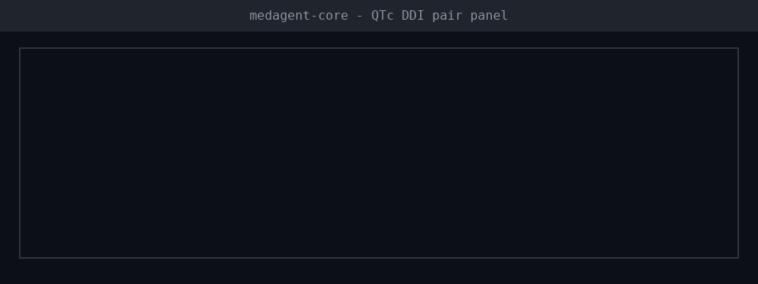
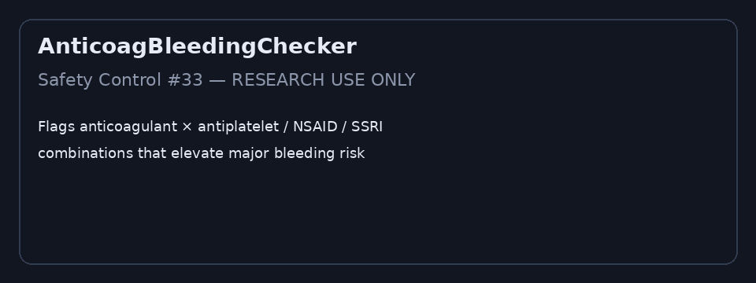
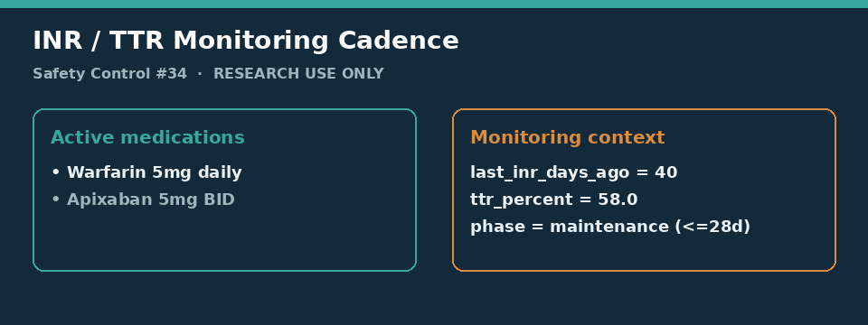
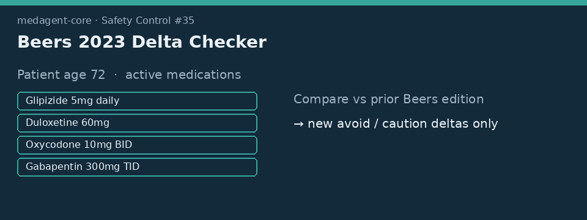
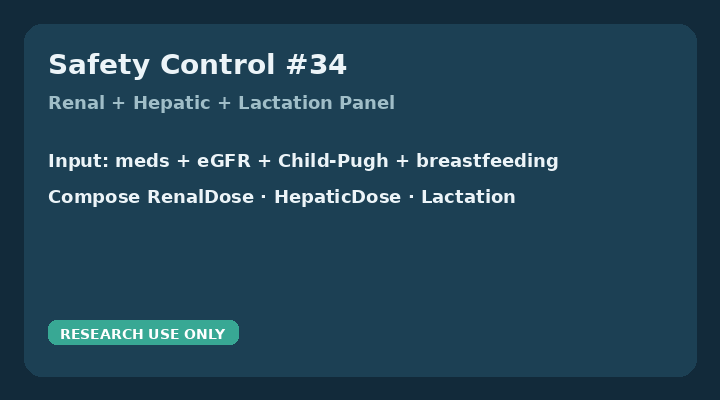

# medagent-core

> **⚠️ RESEARCH USE ONLY — NOT FDA-cleared — NOT for clinical deployment**

**Auditable biomedical AI decision support agent** — multi-hop clinical reasoning, drug interaction detection, and safety-first agentic architecture for health-AI research.

<p align="left">
  <a href="https://github.com/Francis1998/medagent-core/actions/workflows/ci.yml"></a>
  <a href="https://www.python.org/downloads/"></a>
  <a href="LICENSE"></a>
  <a href="#quality-gates"></a>
  <a href="#quality-gates"></a>
  <a href="#quality-gates"></a>
  <a href="#quality-gates"></a>
  <a href="#quality-gates"></a>
  <a href="SAFETY.md"></a>
  <a href="#live-demos"></a>
</p>

---

## Live Demos

**Clinical reasoning pipeline — STEMI chest pain case:**


**Drug interaction screening — warfarin + amiodarone polypharmacy:**


**QTc DDI panel — azithromycin + amiodarone and methadone + ondansetron:**



**Taper-schedule advisory — chronic opioid, Z-drug, SSRI/SNRI, and PPI review flags:**


**Anticoagulation bleeding-risk — warfarin + aspirin and DOAC + NSAID pairs:**



**INR / TTR monitoring cadence — overdue INR and low TTR on warfarin:**


**Beers 2023 update deltas — expanded sulfonylurea avoid, SNRI caution, opioid × gabapentinoid:**


**Renal + hepatic + lactation panel — organ dose caution with breastfeeding risk:**



**ESCALATE trigger — ambiguous B-symptoms, confidence 0.38 < 0.60:**



**Multi-LLM routing — GPT-5.5, Claude Sonnet 4.6, Gemini 3.x, and Kimi K2 failover:**


**FHIR intake — raw PII redaction before model calls:**



**Finite-state machine — inspectable state transitions:**


**Evaluation harness — MedQA-style and drug-interaction regression checks:**


**Audit trace — replayable session history with hashed inputs:**



Run demos locally — no API keys needed:
```bash
git clone https://github.com/Francis1998/medagent-core
cd medagent-core && pip install -e ".[dev]"
python scripts/demo.py --case all
```

---

## The Problem

Clinical AI is broken in a predictable way. Most LLM-wrapper "pipelines" used in health-AI research today:

- Feed patient data into `generate()` and return raw text — **no audit trail, no intermediate state**
- Cannot explain *why* they reached a conclusion — **no evidence chain**
- Surface drug interaction warnings from a single database — **one-source = unvalidated**
- Never say "I don't know" — **no confidence calibration, no escalation**
- Log patient names and MRNs to LLM APIs in plain text — **PII leakage**
- Wrap everything in a `try/except` and call it production — **no safety enforcement**

The result: every health-AI team re-invents the same safety plumbing for months before they can test a single hypothesis. And every team makes the same mistakes.

`medagent-core` is the production-grade, open-source reference implementation that solves these problems — auditably, testably, and without black-box magic.

---

## Use Cases

### 1. Emergency Department Triage Research

**The problem:** ED physicians see 150+ patients per shift. High-acuity presentations require fast differential generation, but cognitive load causes anchoring errors — the first plausible diagnosis becomes the only one considered.

**How medagent-core helps:**
- Ingests triage FHIR data (vitals, chief complaint, prior diagnoses, meds) in under 2 seconds
- Runs biomedical NER to extract symptoms, medications, and lab values simultaneously
- Queries PubMed for top relevant papers on each candidate diagnosis
- Returns a ranked differential with explicit evidence FOR and AGAINST each hypothesis
- If confidence < 0.6 → automatically flags for senior physician review (ESCALATE)

```
Input:  65M, chest pain radiating to left arm, Troponin-I 2.4 ng/mL, ST elevation II/III/aVF
Output: #1 STEMI Inferior (0.89) · #2 NSTEMI (0.61) · #3 Aortic Dissection (0.34)
        Drug interaction: aspirin + metoprolol → MODERATE bradycardia [2 sources]
        → Recommend: immediate cardiology consult · primary PCI evaluation
```

**Research angle:** Study whether AI-assisted triage reduces time-to-diagnosis or anchoring errors in retrospective ED datasets.

---

### 2. Polypharmacy Safety — Automatic Interaction Screening

**The problem:** The average 65+ patient takes 5+ medications. Drug-drug interactions cause ~125,000 deaths per year in the US. Manual review is impractical at scale; existing tools surface too many false positives because they check only one database.

**How medagent-core helps:**
- Queries **both** RxNorm Interaction API **and** OpenFDA drug labels simultaneously
- Only surfaces a warning when **both sources independently confirm** the interaction
- Classifies severity: CRITICAL / HIGH / MODERATE / LOW with mechanism and clinical consequence
- Source attribution enables pharmacist verification before any clinical action

```python
# Real case: warfarin + amiodarone co-prescription
POST /drug-interactions
{ "medications": ["warfarin 5mg", "amiodarone 200mg", "aspirin 81mg", "omeprazole 20mg"] }

→ CRITICAL: warfarin + amiodarone — CYP2C9 inhibition → 3-5× INR elevation
            → VALIDATED ✓ (rxnorm + openfda)
→ MODERATE: warfarin + aspirin — additive anticoagulation + GI mucosal damage
→ MODERATE: omeprazole + warfarin — CYP2C19 inhibition, modest INR increase
```

**Research angle:** Benchmark false positive/negative rates vs DrugBank ground truth using the included `scripts/eval_drugbank.py`.

---

### 3. Clinical AI Reliability Benchmarking

**The problem:** The research community lacks a reproducible, open framework for measuring how well LLMs perform clinical reasoning — and critically, *where* they fail. Published papers benchmark on USMLE but omit prompting strategy, confidence calibration, and failure mode analysis.

**How medagent-core helps:**
- `scripts/eval_medqa.py` runs the full agent pipeline on MedQA USMLE-style questions
- Logs per-question reasoning traces (not just accuracy) enabling qualitative failure analysis
- Compares reasoning quality across GPT-5.5, Claude Sonnet 4.6, Gemini 3.x, and Kimi K2 with identical prompts
- Bayesian confidence score measures calibration: does high confidence correlate with correctness?
- ESCALATE events reveal what the model *doesn't know* — the most clinically important failure mode

```bash
# Compare GPT-5.5 vs Claude on USMLE-style questions:
ANTHROPIC_API_KEY=sk-ant-... python scripts/eval_medqa.py --max-samples 100
OPENAI_API_KEY=sk-...       python scripts/eval_medqa.py --max-samples 100
# Results in results/medqa_eval.json for side-by-side comparison
```

---

### 4. Drug Discovery — Literature Mining and Evidence Synthesis

**The problem:** Biomedical researchers need to synthesise evidence across hundreds of PubMed papers when evaluating a drug candidate or mechanism. Manual review takes weeks; generic RAG pipelines lack biomedical domain awareness and can't construct explicit evidence chains.

**How medagent-core helps:**
- Extracts MeSH terms from clinical entities using scispaCy NER (not keyword search)
- Queries PubMed ESearch/EFetch with structured MeSH queries for higher precision
- Hybrid BM25 + dense retrieval over an ingested local corpus of abstracts
- Evidence chain builder annotates which retrieved papers support each hypothesis with strength scores
- All evidence is source-attributed for direct citation

```bash
# Ingest PubMed abstracts on a target mechanism:
python scripts/ingest_kb.py \
  --pubmed-terms "KRAS G12C inhibitor" "sotorasib resistance" "MAPK pathway" \
  --max-per-term 50

# Query the agent for an evidence synthesis:
POST /analyze
{ "query": "What is the evidence for sotorasib resistance mechanisms in KRAS G12C NSCLC?" }
```

---

### 5. Health-AI Pipeline Development — Reference Architecture

**The problem:** Every health-AI engineering team rebuilds the same safety infrastructure from scratch: PII de-identification, LLM fallback chains, output validation, audit logging, confidence gating. This is months of work done repeatedly with inconsistent safety guarantees.

**How medagent-core helps — use it as your starting point:**

```python
# Add a new LLM provider in ~50 lines:
class MyProviderAdapter(BaseLLMAdapter):
    @property
    def provider_name(self) -> str:
        return "myprovider"

    async def complete(self, prompt: str, **kwargs: Any) -> LLMResponse: ...


# Register it → automatically joins the medical routing fallback chain


# Add a new retrieval source:
async def search(entities: list[ClinicalEntity]) -> list[RetrievedDocument]: ...


# Add to RetrievalOrchestrator → runs in parallel with PubMed + local KB
```

All safety infrastructure (PII hashing, disclaimer injection, dual-source drug validation, ESCALATE gating) is production-hardened and covered by 322 unit tests. You inherit it for free.

---

### 6. AI Safety Research in High-Stakes Domains

**The problem:** AI safety researchers studying failure modes in high-stakes applications need realistic, instrumented systems where agent behaviour can be inspected, modified, and adversarially tested. Most clinical AI is closed-source.

**How medagent-core helps:**
- The ESCALATE mechanism is a novel studied safety pattern: what triggers it, what happens after, and whether it correctly identifies genuine uncertainty — all observable
- Every state transition, confidence score, evidence item, and uncertainty flag is persisted to the audit log
- Jailbreak and scope-violation detection in `ScopeEnforcer` can be extended and stress-tested
- HMAC-SHA256 PII hashing with configurable salts enables privacy-preserving research on real cohort data
- Adversarial prompt handling is isolated to `safety/scope_enforcer.py` with explicit test coverage

**Research angle:** Study the conditions under which the ESCALATE gate fails, measure confidence calibration under distribution shift, or evaluate jailbreak resistance against biomedical adversarial prompts.

---

### 7. Medical Education — Explicit Differential Reasoning

**The problem:** Medical students learning clinical reasoning struggle to understand *why* a diagnosis is ranked above another. The reasoning chain is implicit in a clinician's head. AI-generated explicit differential reasoning chains could be a novel educational resource.

**How medagent-core helps:**
- Returns ranked hypotheses with evidence FOR and AGAINST each — the exact structure used in clinical case discussions
- Uncertainty flags teach the "know what you don't know" principle
- ESCALATE trigger illustrates the critical skill of recognising diagnostic limits
- Eval scripts support USMLE-style case analysis at scale for curriculum development

```bash
# Test on a clinical case:
python scripts/demo.py --case escalate
# Shows a case where the agent correctly recognises it cannot determine the diagnosis
# and explicitly refuses to produce a recommendation — the right clinical behaviour
```

---

## Architecture — Observe → Decide → Act

```
┌──────────────────────────────────────────────────────────────────────┐
│  POST /analyze (FHIR patient context + clinical query)               │
└────────────────────────────┬─────────────────────────────────────────┘
                             │
         ┌───────────────────▼────────────────────────┐
         │        ClinicalAgentStateMachine            │
         │                                             │
         │  INTAKE ──► ENTITY_EXTRACTION               │
         │                    │                        │
         │          KNOWLEDGE_RETRIEVAL                │
         │         /     │           \                 │
         │      PubMed  RxNorm+FDA  LocalKB            │
         │      (async) (async)     (async)            │
         │         \     │           /                 │
         │           REASONING (LLM)                   │
         │                │                            │
         │          SAFETY_CHECK                       │
         │         /              \                    │
         │     OUTPUT          ESCALATE                │
         │   conf ≥ 0.6       conf < 0.6 OR            │
         │                    contradictions            │
         └─────────────────────────────────────────────┘
                             │
                     audit_log.db (every run, immutable)
```

| Stage | Component | Timeout |
|---|---|---|
| **INTAKE** | `ScopeEnforcer` + PII hashing | — |
| **ENTITY_EXTRACTION** | `EntityExtractor` (scispaCy NER + regex fallback) | 10s |
| **KNOWLEDGE_RETRIEVAL** | `RetrievalOrchestrator` (parallel fan-out) | 20s/source |
| **REASONING** | `ReasoningEngine` + `MedicalRouter` | 90s |
| **SAFETY_CHECK** | Confidence gate + contradiction detection | — |
| **OUTPUT / ESCALATE** | `ClinicalReasoning` + mandatory disclaimer | — |

---

## Safety — 28 Hard Controls
## Safety — 29 Hard Controls

All controls are **technically enforced in code**, not just documented policy:

| # | Control | Where enforced | What it does |
|---|---|---|---|
| 1 | Mandatory disclaimer | `models.py` | Injected at construction time — cannot be overridden via API |
| 2 | Medical system prompt | `safety/disclaimer.py` | Prohibits prescriptions, internet, code execution |
| 3 | Output validation | `llm/validator.py` | Rejects prescription language before returning |
| 4 | ESCALATE gate | `agent/state_machine.py` | Auto-escalates when confidence < threshold |
| 5 | PII hashing | `safety/pii_hasher.py` | HMAC-SHA256 before any LLM call |
| 6 | Scope enforcement | `safety/scope_enforcer.py` | Rejects 12 prohibited query patterns |
| 7 | Dual-source drug validation | `models.py` | Pydantic enforces ≥2 sources at model construction |
| 8 | Hard timeouts | `api/main.py` | 120s total, per-stage limits |
| 9 | Drug-allergy conflict check | `safety/allergy_checker.py` | Flags medications conflicting with documented allergies (direct + intra-class cross-reactivity) |
| 10 | Duplicate-therapy detection | `safety/duplicate_therapy.py` | Flags ≥2 distinct agents from one therapeutic class |
| 11 | Pregnancy-safety check | `safety/pregnancy_checker.py` | Flags teratogenic/contraindicated medications for pregnant patients |
| 12 | QT-prolongation check | `safety/qt_prolongation_checker.py` | Flags QT-prolonging medications; elevates severity for additive (co-prescribed) torsades risk |
| 13 | Anticholinergic-burden check | `safety/anticholinergic_burden_checker.py` | Scores medications on the ACB scale and elevates severity when cumulative burden reaches the clinically significant threshold (≥3) |
| 14 | Serotonin-syndrome check | `safety/serotonin_syndrome_checker.py` | Flags ≥2 co-prescribed serotonergic agents (HIGH), escalating to CRITICAL when an MAOI is part of the combination |
| 15 | Beers Criteria (older-adult PIMs) | `safety/beers_criteria_checker.py` | Flags potentially inappropriate medications for adults aged ≥65 (age-conditioned, single-agent) |
| 16 | Renal-dose (eGFR) check | `safety/renal_dose_checker.py` | Flags renally-cleared medications inappropriate for the patient's eGFR with an avoid/reduce-dose action |
| 17 | Hepatic-dose (Child-Pugh) check | `safety/hepatic_dose_checker.py` | Flags hepatically-cleared or hepatotoxic medications inappropriate for the patient's Child-Pugh class with an avoid/reduce-dose action |
| 18 | Lab critical-value (panic) check | `safety/lab_critical_value_checker.py` | Flags laboratory results crossing a standardized critical/panic threshold (e.g. potassium >6.0, glucose <40, INR >5.0) for urgent clinician notification |
| 19 | Drug–food interaction check | `safety/drug_food_interaction_checker.py` | Flags medication × dietary-exposure pairs (grapefruit/statins, dairy/tetracyclines–ciprofloxacin, tyramine/MAOIs, alcohol/metronidazole–disulfiram) |
| 20 | Opioid MED (MME) check | `safety/opioid_med_checker.py` | Sums CDC-style morphine-equivalent dose across active opioids and elevates severity when total MED ≥ threshold (default 90) |
| 21 | Pediatric dose / age check | `safety/pediatric_dose_checker.py` | Flags paediatric age contraindications (e.g. codeine/tramadol <12y) and mg/kg/day ceiling excesses |
| 22 | STOPP/START check | `safety/stopp_start_checker.py` | Flags STOPP avoidances and START omissions for adults ≥65 (complements Beers) |
| 23 | FDA black-box warning check | `safety/black_box_warning_checker.py` | Flags agents with FDA boxed warnings |
| 24 | Combined renal + hepatic check | `safety/combined_renal_hepatic_checker.py` | Flags medications that have both eGFR and Child-Pugh concerns for the same patient context |
| 25 | Geriatric deprescribing check | `safety/geriatric_deprescribing_checker.py` | Flags older-adult deprescribing opportunities such as long-term PPIs without indication, Z-drugs, first-generation antihistamines, and chronic NSAIDs |
| 26 | Antibiotic stewardship check | `safety/antibiotic_stewardship_checker.py` | Flags fluoroquinolones without documented indication, duplicate antimicrobial coverage, and prolonged-course cues |
| 27 | QTc DDI panel check | `safety/qtc_ddi_checker.py` | Flags named synergistic QTc-prolonging DDI pairs such as methadone+ondansetron and azithromycin+amiodarone |
| 28 | Lactation / breastfeeding medication-safety check | `safety/lactation_checker.py` | Flags breastfeeding-specific medication concerns such as radioiodine/I-131, chemotherapy agents, amiodarone, lithium, codeine, and tramadol when the patient is breastfeeding |
| 29 | Taper-schedule advisory check | `safety/taper_schedule_checker.py` | Flags chronic/scheduled opioids, benzodiazepines/Z-drugs, PPIs, and SSRIs/SNRIs for research-only taper-schedule review without prescribing or auto-generating taper plans |
| 42 | Chemotherapy emetogenicity / antiemetic prophylaxis | `safety/chemo_emesis_checker.py` | Flags high/moderate emetogenic chemo when antiemetic prophylaxis missing or delayed-phase uncovered (days 2–5 post-chemo) |
| 30 | Fall-risk medication check | `safety/fall_risk_checker.py` | Flags medications that increase fall risk in adults ≥65 (benzodiazepines, Z-drugs, anticholinergic subset, antipsychotics, muscle relaxants, alpha-1 blockers) |
| 31 | QTc monitoring interval check | `safety/qtc_monitoring_checker.py` | Flags missing or overdue ECG/QTc monitoring for high-risk QT-prolonging drugs (7-day initiation, 30-day maintenance intervals) |
| 32 | Combined pregnancy + lactation check | `safety/pregnancy_lactation_checker.py` | Unifies pregnancy teratogen and lactation/breastfeeding panels; escalates severity when the same medication triggers both concerns |
| 33 | Anticoagulation bleeding-risk check | `safety/anticoag_bleeding_checker.py` | Flags anticoagulant × antiplatelet/NSAID/SSRI combinations that elevate major bleeding risk (warfarin, apixaban, rivaroxaban, dabigatran, enoxaparin, heparin + aspirin/clopidogrel/ibuprofen/naproxen/sertraline, etc.) |
| 34 | Anticoagulation INR / TTR monitoring cadence check | `safety/inr_ttr_checker.py` | Flags missing or overdue INR checks and suboptimal TTR for warfarin/VKA patients (7-day initiation, 28-day maintenance; default TTR threshold 65%) |
| 35 | Beers 2023 criteria update-delta check | `safety/beers_2023_delta_checker.py` | Flags 2023 AGS Beers update deltas vs prior (aspirin primary-prevention avoid, warfarin→DOAC preference, rivaroxaban/dabigatran caution, expanded sulfonylureas, SNRI falls caution, opioid×gabapentinoid concurrent avoid) |
| 36 | Combined renal + hepatic + lactation check | `safety/renal_hepatic_lactation_checker.py` | Unifies renal dose, hepatic dose, and lactation/breastfeeding panels; escalates severity when the same medication triggers organ-impairment and lactation concerns |
| 37 | Pediatric renal dosing check | `safety/pediatric_renal_checker.py` | Flags renally-cleared meds in pediatric patients when eGFR/CrCl missing or below age-adjusted thresholds (aminoglycosides, vancomycin, acyclovir, cephalosporins, etc.) |
| 38 | MAOI + serotonergic cross-check | `safety/maoi_serotonin_checker.py` | Flags MAOI × SSRI/SNRI/triptan/serotonergic-opioid pairs with CRITICAL severity (complements serotonin-syndrome checker) |
| 39 | Antibiotic duration stewardship check | `safety/antibiotic_duration_checker.py` | Flags antibiotic courses exceeding recommended duration or missing stop date when days_on_therapy provided (complements antibiotic_stewardship_checker) |
| 40 | Electrolyte panel (K/Mg) with QT drugs | `safety/electrolyte_qt_checker.py` | Flags QT-prolonging meds when potassium or magnesium labs missing or low (K &lt;3.5, Mg &lt;1.7) |
| 41 | Opioid + benzodiazepine/Z-drug CNS depression | `safety/opioid_benzo_checker.py` | Flags opioid × benzodiazepine/Z-drug pairs with CRITICAL severity (respiratory depression risk) |
| 43 | Digoxin toxicity risk | `safety/digoxin_toxicity_checker.py` | Flags digoxin when hypokalemia, hypomagnesemia, or loop diuretic without K/Mg repletion elevates toxicity risk |
| 19 | Drug–food interaction check | `safety/drug_food_interaction_checker.py` | Flags medication × dietary-exposure pairs (grapefruit/statins, dairy/tetracyclines–ciprofloxacin, tyramine/MAOIs, alcohol/metronidazole–disulfiram) |
| 44 | Statin + strong CYP3A4 inhibitor | `safety/statin_cyp3a4_checker.py` | Flags simvastatin/lovastatin/atorvastatin with strong CYP3A4 inhibitors (myopathy/rhabdomyolysis risk) |
| 45 | Insulin stacking | `safety/insulin_stacking_checker.py` | Flags overlapping rapid-acting boluses (&lt;3 h) without meal/correction context or concurrent premix+bolus |
| 46 | Triple whammy (NSAID+ACEI/ARB+diuretic) | `safety/triple_whammy_checker.py` | Flags concurrent NSAID + ACEI/ARB/ARNI + loop/thiazide diuretic (AKI / renal risk) |
| 52 | Clozapine ANC monitoring | `safety/clozapine_anc_checker.py` | Flags clozapine/Clozaril/FazaClo with CRITICAL ANC / agranulocytosis monitoring reminder |
| 54 | Macrolide + digoxin P-gp | `safety/macrolide_digoxin_checker.py` | Flags digoxin/lanoxin with clarithromycin/erythromycin (not azithromycin) — HIGH digoxin toxicity risk |
| 55 | Lithium + NSAID toxicity | `safety/lithium_nsaid_checker.py` | Flags lithium/lithobid/eskalith with NSAIDs (not acetaminophen/paracetamol) — HIGH lithium toxicity risk |
| 56 | Methotrexate + TMP-SMX toxicity | `safety/mtx_tmpsmx_checker.py` | Flags methotrexate with TMP-SMX / co-trimoxazole (trimethoprim, sulfamethoxazole, bactrim, septra, cotrimoxazole) — CRITICAL myelosuppression risk |
| 57 | DOAC + antiplatelet bleed intensifier | `safety/doac_antiplatelet_checker.py` | Flags apixaban/rivaroxaban/edoxaban/dabigatran with aspirin/clopidogrel/prasugrel/ticagrelor — HIGH major bleeding risk |
| 58 | Amiodarone + warfarin INR interaction | `safety/amio_warfarin_checker.py` | Flags amiodarone/cordarone/pacerone with warfarin/coumadin/jantoven — HIGH INR/bleeding risk |
| 59 | Fluoroquinolone + warfarin INR/bleeding interaction | `safety/fluoroquinolone_warfarin_checker.py` | Flags ciprofloxacin/levofloxacin/moxifloxacin/ofloxacin with warfarin/coumadin/jantoven — HIGH INR variability and bleeding risk |
| 60 | ACEI/ARB + potassium-sparing hyperkalemia | `safety/acei_ksparing_checker.py` | Flags ACE inhibitors or ARBs with spironolactone/eplerenone/amiloride/triamterene — HIGH hyperkalemia and renal-function risk |
| 53 | SGLT2 + loop diuretic volume depletion | `safety/sglt2_loop_checker.py` | Flags empagliflozin/dapagliflozin/canagliflozin/ertugliflozin with furosemide/bumetanide/torsemide/ethacrynic — HIGH |
| 51 | Tramadol + SSRI/SNRI dual risk | `safety/tramadol_ssri_checker.py` | Flags tramadol/ultram with SSRI/SNRI (seizure + serotonin risk) — HIGH |
| 47 | Methotrexate without folate | `safety/mtx_folate_checker.py` | Flags methotrexate without folic acid / folate / leucovorin co-therapy |
| 48 | Digoxin + amiodarone monitoring | `safety/digoxin_amio_checker.py` | Flags digoxin with amiodarone for level monitoring (HIGH) |
| 49 | Warfarin + NSAID bleed intensifier | `safety/warfarin_nsaid_checker.py` | Flags warfarin/coumadin/jantoven with NSAID (ibuprofen, naproxen, diclofenac, ketorolac, meloxicam, aspirin) — HIGH/CRITICAL |
| 50 | ACEI + ARB + ARNI duplication | `safety/acei_arb_duplication_checker.py` | Flags ≥2 distinct RAAS classes (ACEI/ARB/ARNI) — dual blockade HIGH/CRITICAL |
| 61 | NSAID + SSRI/SNRI bleed intensifier | `safety/nsaid_ssri_checker.py` | Flags NSAIDs with SSRIs/SNRIs — HIGH gastrointestinal and other bleeding risk |
| 62 | Fluoroquinolone + NSAID CNS/seizure risk | `safety/fluoroquinolone_nsaid_checker.py` | Flags ciprofloxacin/levofloxacin/moxifloxacin/ofloxacin with NSAIDs — HIGH CNS stimulation / seizure-risk intensifier |
| 63 | ACEI/ARB + trimethoprim / TMP-SMX hyperkalemia | `safety/acei_trimethoprim_checker.py` | Flags ACE inhibitors or ARBs with trimethoprim/bactrim/septra/cotrimoxazole — HIGH/CRITICAL hyperkalemia risk |
| 64 | SSRI/SNRI + triptan serotonin pair | `safety/ssri_triptan_checker.py` | Flags SSRIs/SNRIs with triptans (sumatriptan/rizatriptan/eletriptan/…) — HIGH serotonin-syndrome pair risk |
| 65 | Fluoroquinolone + corticosteroid tendon risk | `safety/fluoroquinolone_corticosteroid_checker.py` | Flags ciprofloxacin/levofloxacin/moxifloxacin/ofloxacin with systemic corticosteroids — HIGH tendon rupture / tendinopathy risk |
| 66 | Digoxin + verapamil toxicity | `safety/digoxin_verapamil_checker.py` | Flags digoxin/lanoxin with verapamil/calan/isoptin/verelan — HIGH digoxin toxicity via P-gp / reduced clearance |
| 67 | Statin + macrolide CYP3A4 interaction | `safety/statin_macrolide_checker.py` | Flags simvastatin/lovastatin (CRITICAL) or atorvastatin (HIGH) with clarithromycin/erythromycin — CYP3A4 myopathy/rhabdomyolysis risk |
| 68 | Warfarin + systemic azole antifungal | `safety/warfarin_azole_checker.py` | Flags warfarin/Coumadin with fluconazole/voriconazole (CRITICAL) or ketoconazole/itraconazole (HIGH) — CYP2C9/CYP-mediated INR elevation and bleeding risk |
| 71 | DOAC + NSAID bleed intensifier | `safety/doac_nsaid_checker.py` | Flags apixaban/rivaroxaban/edoxaban/dabigatran with NSAIDs (ketorolac CRITICAL; others HIGH) — anticoagulation plus GI/platelet bleeding intensifier |
| 72 | SGLT2 + ACEI/ARB/ARNI volume/hyperkalemia risk | `safety/sglt2_raasi_checker.py` | Flags SGLT2 inhibitors with ACEI/ARB/ARNI partners — HIGH volume depletion, AKI, and hyperkalemia risk |
| 74 | PPI + methotrexate toxicity | `safety/ppi_mtx_checker.py` | Flags methotrexate with omeprazole/esomeprazole/pantoprazole/lansoprazole/rabeprazole — HIGH toxicity risk from potentially reduced clearance |
| 75 | Linezolid + SSRI/SNRI serotonin syndrome | `safety/linezolid_ssri_checker.py` | Flags linezolid with supported SSRIs/SNRIs — CRITICAL serotonin-syndrome risk from reversible MAOI-like activity |
| 76 | Lithium + ACEI/ARB toxicity | `safety/lithium_acei_checker.py` | Flags lithium/Lithobid/Eskalith with supported ACE inhibitors or ARBs — HIGH lithium-toxicity risk from potentially reduced renal clearance |
| 77 | Theophylline + CYP1A2-inhibiting quinolone toxicity | `safety/theophylline_cipro_checker.py` | Flags theophylline-class agents with ciprofloxacin/Cipro (HIGH) or enoxacin (CRITICAL) — reduced clearance and toxicity risk |
| 78 | Amiodarone + digoxin P-gp interaction | `safety/amiodarone_digoxin_checker.py` | Flags amiodarone/Cordarone/Pacerone with digoxin/Lanoxin — HIGH digoxin-toxicity risk from P-gp inhibition and reduced clearance |
| 79 | Carbamazepine + CYP3A4-inhibiting macrolide | `safety/carbamazepine_macrolide_checker.py` | Flags carbamazepine/Tegretol/Carbatrol/Equetro with clarithromycin or erythromycin (not azithromycin) — HIGH carbamazepine-toxicity risk |
| 80 | Warfarin + metronidazole/tinidazole CYP2C9/INR risk | `safety/warfarin_metronidazole_checker.py` | Flags warfarin/Coumadin/Jantoven with metronidazole or tinidazole — HIGH INR elevation and bleeding risk from reduced warfarin clearance |
| 81 | Colchicine + strong CYP3A4 inhibitor toxicity | `safety/colchicine_cyp3a4_checker.py` | Flags colchicine-class agents with clarithromycin, ketoconazole, itraconazole, or ritonavir — CRITICAL severe or fatal colchicine-toxicity risk |
| 82 | Lithium + thiazide diuretic toxicity | `safety/lithium_thiazide_checker.py` | Flags lithium/Lithobid/Eskalith with hydrochlorothiazide/HCTZ, chlorthalidone, or indapamide — HIGH lithium-toxicity risk from reduced renal clearance |
| 83 | Tramadol + bupropion seizure risk | `safety/tramadol_bupropion_checker.py` | Flags tramadol/Ultram with bupropion/Wellbutrin/Zyban — HIGH compounded seizure-threshold-lowering risk; distinct from tramadol + SSRI/SNRI |
| 84 | Methotrexate + penicillin toxicity | `safety/mtx_penicillin_checker.py` | Flags methotrexate/MTX with penicillin/penicillin-V/Pen-VK/amoxicillin/ampicillin — HIGH toxicity risk from reduced methotrexate clearance |
| 85 | Sildenafil + nitrate hypotension | `safety/sildenafil_nitrate_checker.py` | Flags sildenafil/Viagra/Revatio with nitroglycerin/isosorbide/Imdur/Monoket — CRITICAL profound hypotension risk |
| 86 | Allopurinol + azathioprine/6-MP toxicity | `safety/allopurinol_azathioprine_checker.py` | Flags allopurinol/Zyloprim with azathioprine/Imuran/mercaptopurine/6-MP/Purinethol — CRITICAL xanthine-oxidase inhibition / thiopurine-toxicity risk |
| 87 | Codeine + CYP2D6 inhibitor analgesia risk | `safety/codeine_cyp2d6_checker.py` | Flags codeine/Tylenol-with-codeine with fluoxetine/paroxetine/bupropion/quinidine/terbinafine — HIGH risk of reduced morphine formation and altered analgesia; distinct from other opioid checkers |
| 88 | ACEI/ARB + potassium supplement hyperkalemia | `safety/acei_potassium_checker.py` | Flags ACEIs/ARBs with potassium/KCl/Klor-Con/potassium-chloride — HIGH hyperkalemia risk; distinct from ACEI + K-sparing (#60) and ACEI + TMP (#63) |
| 90 | Isotretinoin + tetracycline-class pseudotumor cerebri | `safety/isotretinoin_tetracycline_checker.py` | Flags isotretinoin/Accutane/Absorica/Claravis/Myorisan/Zenatane with tetracycline/doxycycline/minocycline — CRITICAL pseudotumor cerebri / intracranial hypertension risk |
| 89 | Metformin + iodinated contrast lactic acidosis | `safety/metformin_contrast_checker.py` | Flags metformin/Glucophage/Fortamet/Glumetza/Riomet with contrast/iohexol/iodixanol/iopamidol — HIGH peri-contrast lactic-acidosis risk; distinct from general metformin renal-dose checking |
| 91 | Methadone + QT-prolonging drug intensification | `safety/methadone_qt_checker.py` | Flags methadone/Dolophine/Methadose with haloperidol/ziprasidone/citalopram (CRITICAL) or ondansetron/azithromycin/escitalopram (HIGH) — QT intensification/torsades risk; distinct from general QT screen (`qt_prolongation_checker.py`) |
| 92 | Valproate + carbapenem precipitous level drop | `safety/valproate_carbapenem_checker.py` | Flags valproate/valproic acid/divalproex/Depakote/Depakene with meropenem/ertapenem/imipenem/doripenem/carbapenem — CRITICAL seizure risk from precipitous valproate level drop; distinct from general AED screens |
| 93 | Lamotrigine + valproate SJS/TEN risk | `safety/lamotrigine_valproate_checker.py` | Flags lamotrigine/Lamictal with valproate/valproic acid/divalproex/Depakote — CRITICAL SJS/TEN risk from inhibited lamotrigine metabolism; distinct from valproate-carbapenem |
| 94 | Fentanyl + CYP3A4 inhibitor exposure | `safety/fentanyl_cyp3a4_checker.py` | Flags fentanyl/Duragesic/Abstral/Fentora/Actiq with strong CYP3A4 inhibitors (ketoconazole/itraconazole/ritonavir/clarithromycin/nefazodone — CRITICAL) or moderate inhibitors (erythromycin/fluconazole/diltiazem/verapamil — HIGH) — respiratory-depression risk; distinct from opioid_benzo / opioid MED |
| 95 | Colchicine + strong CYP3A4/P-gp inhibitor toxicity | `safety/colchicine_cyp3a4_checker.py` | Flags colchicine/Colcrys/Mitigare/Gloperba with clarithromycin/ketoconazole/itraconazole/ritonavir/cyclosporine/cobicistat/posaconazole — CRITICAL fatal toxicity (FDA boxed-warning); distinct from fentanyl CYP3A4 |
| 96 | Clozapine + strong CYP1A2 inhibitor exposure | `safety/clozapine_cyp1a2_checker.py` | Flags clozapine/Clozaril/FazaClo/Versacloz with fluvoxamine/Luvox (CRITICAL) or ciprofloxacin/Cipro (HIGH) — elevated levels with seizure/myocarditis risk; distinct from clozapine ANC |
| 97 | DOAC + strong inducer thrombosis risk | `safety/doac_inducer_checker.py` | Flags apixaban/rivaroxaban/edoxaban/dabigatran (and brands) with rifampin/rifampicin (CRITICAL) or carbamazepine/phenytoin/St John's wort (HIGH) — reduced exposure / thrombosis risk; distinct from warfarin checkers |
| 98 | Statin + fibrate myopathy/rhabdomyolysis | `safety/statin_fibrate_checker.py` | Flags simvastatin/lovastatin/atorvastatin/rosuvastatin/pravastatin/fluvastatin/pitavastatin (and brands) with gemfibrozil (CRITICAL) or fenofibrate/fenofibric acid (HIGH) — myopathy/rhabdomyolysis risk; distinct from statin CYP3A4 / statin macrolide |

See [SAFETY.md](SAFETY.md) for the full policy, regulatory status, and escalation procedures.

---

## Quick Start

```bash
git clone https://github.com/Francis1998/medagent-core
cd medagent-core
pip install -e ".[dev]"
cp .env.example .env             # add at least one LLM API key
python scripts/ingest_kb.py --sample
uvicorn medagent.api.main:app --reload
```

**No API keys?** The demo and eval scripts still work in fallback mode:
```bash
python scripts/demo.py --case all          # rich interactive demo
python scripts/eval_medqa.py --max-samples 3    # demo mode
python scripts/eval_drugbank.py                  # demo mode
```

Full setup: [QUICKSTART.md](QUICKSTART.md) · Docker Compose: `docker-compose up --build`

---

## API

### `POST /analyze` — Full clinical reasoning
```json
{
  "patient_context": {
    "patient_id_hash": "<sha256 of MRN>",
    "age": 65, "sex": "male",
    "chief_complaint": "Chest pain radiating to left arm",
    "clinical_notes": "2h history of crushing substernal pain...",
    "medications": [{"name": "aspirin"}, {"name": "metoprolol"}],
    "lab_results": [{"test_name": "Troponin I", "value": "2.4", "unit": "ng/mL", "abnormal": true}]
  },
  "query": "What is the differential diagnosis?"
}
```

Response includes `ranked_hypotheses`, `drug_interactions_flagged`, `overall_confidence`, `escalated`, `evidence_chain`, `uncertainty_flags`, `recommended_next_steps`, and the mandatory `disclaimer`.

### `POST /drug-interactions` — Targeted interaction check
### `GET /health` — Readiness probe

Interactive docs: http://localhost:8000/docs

---

## Benchmarks

```bash
python scripts/eval_medqa.py --max-samples 100   # MedQA USMLE accuracy
python scripts/eval_drugbank.py                   # Drug interaction F1/precision/recall
```

Results saved to `results/` as JSON + printed summary.

---

## Quality Gates

```bash
ruff check src/     # zero errors
pytest tests/ -v    # 396/396 passed
```

CI: lint → test → eval smoke test → Docker build (see [`.github/workflows/ci.yml`](.github/workflows/ci.yml)).

---

## Repository Structure

```
medagent-core/
├── src/medagent/
│   ├── agent/          # FSM state machine + durable SQLAlchemy audit log
│   ├── extraction/     # scispaCy NER (regex fallback) + FHIR R4 parser
│   ├── retrieval/      # PubMed + RxNorm/OpenFDA + local KB hybrid retrieval
│   ├── reasoning/      # Bayesian scorer + evidence chain builder + LLM engine
│   ├── llm/            # OpenAI/Anthropic/Google/Kimi adapters + router + validator
│   ├── safety/         # PII hashing + scope enforcer + mandatory disclaimers
│   └── api/            # FastAPI: /analyze /drug-interactions /health
├── tests/              # 396 pytest tests — all typed + documented
├── scripts/
│   ├── demo.py         # Rich interactive demo (3 clinical cases, no API keys needed)
│   ├── eval_medqa.py   # USMLE benchmark runner
│   ├── eval_drugbank.py# Drug interaction F1 evaluator
│   └── ingest_kb.py    # KB ingestion from JSONL or live PubMed
├── assets/             # Animated SVG/GIF demos
├── data/               # Sample FHIR R4 bundle + KB index
├── results/            # Benchmark outputs (gitignored except .gitkeep)
├── .github/workflows/  # CI: ruff + mypy + pytest + Docker
├── docker-compose.yml
├── Dockerfile
├── QUICKSTART.md
├── CONFIGURATION.md
├── SAFETY.md
└── ARCHITECTURE.md
```

---

## Contributing

1. Open an issue before large PRs
2. Tag safety-relevant issues `safety-critical`
3. All code requires type annotations, docstrings, and tests
4. Run `ruff check src/ && pytest tests/` before submitting

---

## License

Apache 2.0 — see [LICENSE](LICENSE).

---

## Disclaimer

**This software is provided for research and educational purposes only. It is NOT intended for clinical use, medical diagnosis, or treatment planning. It has NOT been evaluated, validated, or cleared by any regulatory authority including the FDA or EMA. Do NOT use this system to make clinical decisions. Always consult a qualified healthcare professional.**
