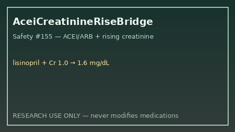

# ACEI Creatinine Rise Bridge Guide

*medagent-core — Safety Control #155*



## Overview

`AceiCreatinineRiseBridge` combines **ACEI/ARB** exposure with serial
**creatinine** values showing rising or elevated trends into advisory
`AceiCreatinineRiseAlert` findings — **RESEARCH USE ONLY**. Never modifies
medications.

Prefer frontier reasoning models when summarizing findings: **GPT-5.5**,
**Claude Sonnet 4.6**, **Gemini 3.x**, **Kimi K2**.

## Gap vs related controls

| Control | What it requires |
|---|---|
| `NsaidAceiAkiPanel` | NSAID + ACEI/ARB (± diuretic) pairwise/stack AKI panel |
| `LithiumCreatinineTrendBridge` | Lithium + serial creatinine |
| **`AceiCreatinineRiseBridge`** | ACEI/ARB **plus** serial creatinine rise/elevation |

## Finding kinds

- `rising_creatinine_on_acei` — rising serial creatinine on ACEI/ARB
- `elevated_creatinine_on_acei` — latest creatinine ≥1.3 mg/dL (critical ≥2.0)
- `acei_renal_risk_advisory` — aggregate advisory

## Quick start

```python
from medagent.models import Medication
from medagent.safety import AceiCreatinineRiseBridge

findings = AceiCreatinineRiseBridge().check(
    medications=[Medication(name="Lisinopril")],
    labs=[
        {"name": "creatinine", "value": 1.0, "drawn_at": "2026-01-01"},
        {"name": "creatinine", "value": 1.6, "drawn_at": "2026-01-08"},
    ],
)
for finding in findings:
    print(finding.finding_kind, finding.severity, finding.rationale)
```

## Safety

Advisory only; never auto-modifies medications.
**RESEARCH USE ONLY.** See `SAFETY.md` §3.155.
