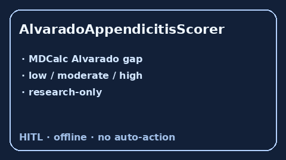

# AlvaradoAppendicitisScorer Guide



Research-only Alvarado appendicitis score. Never modifies medications.

Optional polish via **GPT-5.5 / Claude Sonnet 4.6 / Gemini 3.x / Kimi K2**.

Distinct from `OttawaAnkleRuleScorer` and `CentorStrepPharyngitisScorer`.

## Usage

```python
from medagent.safety.alvarado_appendicitis_scorer import (
    AlvaradoAppendicitisFactors,
    AlvaradoAppendicitisScorer,
)

findings = AlvaradoAppendicitisScorer().check(
    AlvaradoAppendicitisFactors(rlq_tenderness=1, leukocytosis=1)
)
assert findings[0].rationale.startswith("RESEARCH USE ONLY")
print(findings[0].band, findings[0].score)
```
