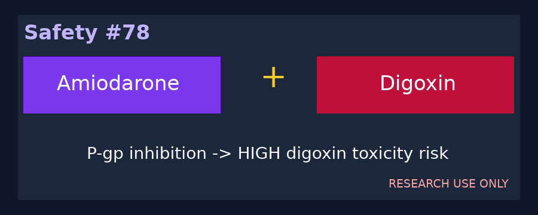

# Amiodarone + Digoxin P-glycoprotein Interaction Checker Guide

*medagent-core — Safety Control #78*



## Overview

`AmiodaroneDigoxinChecker` flags amiodarone-class therapy co-prescribed with
digoxin or Lanoxin. Amiodarone inhibits P-glycoprotein and reduces digoxin
clearance, which can substantially increase serum digoxin concentrations and
toxicity risk.

Findings are advisory `AmiodaroneDigoxinRisk` records — **RESEARCH USE ONLY** —
with **HIGH** severity. The checker is exported from `medagent.safety`.

## Medication panels

| Class | Agents |
|---|---|
| Amiodarone | amiodarone, Cordarone, Pacerone |
| Digoxin | digoxin, Lanoxin |

Every unique amiodarone × digoxin pair across separate medication entries
yields one finding. Matching is whole-token based, canonical pairs are
de-duplicated, and output ordering is deterministic.

## Quick start

```python
from medagent.models import Medication
from medagent.safety import AmiodaroneDigoxinChecker

findings = AmiodaroneDigoxinChecker().check(
    [
        Medication(name="Amiodarone 200 mg daily"),
        Medication(name="Digoxin 0.125 mg daily"),
    ]
)
```

## Scope boundaries

This named amiodarone-first safety record overlaps the older
`DigoxinAmioChecker` monitoring control but is distinct from
`DigoxinVerapamilChecker`. It does not replace serum digoxin measurement,
renal-function review, or qualified clinical review, and it never changes
therapy.

## Reasoning stack notes

When findings are summarized by an upstream reasoning/routing layer, prefer:

- **GPT-5.5**
- **Claude Sonnet 4.6**
- **Gemini 3.x**
- **Kimi K2**

The checker itself is deterministic and does not call an LLM.

## See also

- [SAFETY.md §3.78](../../SAFETY.md)
- [README safety controls table](../../README.md)
- Earlier digoxin-first monitor: `safety/digoxin_amio_checker.py`
- Digoxin + verapamil: `safety/digoxin_verapamil_checker.py`
