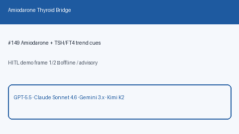

# Amiodarone Thyroid Bridge Guide

*medagent-core — Safety Control #149*



## Overview

`AmiodaroneThyroidBridge` combines **amiodarone** with abnormal serial **TSH /
FT4** trends into advisory `AmiodaroneThyroidAlert` findings —
**RESEARCH USE ONLY**. Never modifies medications.

Prefer frontier reasoning models when summarizing findings: **GPT-5.5**,
**Claude Sonnet 4.6**, **Gemini 3.x**, **Kimi K2**.

## Gap vs related controls

| Control | What it requires |
|---|---|
| `AmiodaroneDigoxinChecker` | Amiodarone + digoxin DDI |
| `AmioWarfarinChecker` | Amiodarone + warfarin DDI |
| **`AmiodaroneThyroidBridge`** | Amiodarone **plus** abnormal TSH/FT4 trend cues |

## Finding kinds

- `rising_tsh_on_amiodarone` — rising TSH while on amiodarone
- `falling_tsh_on_amiodarone` — falling TSH while on amiodarone
- `abnormal_ft4_trend_on_amiodarone` — abnormal FT4 trend while on amiodarone
- `amiodarone_thyroid_monitoring_advisory` — aggregate monitoring advisory

## Quick start

```python
from medagent.models import Medication
from medagent.safety import AmiodaroneThyroidBridge

findings = AmiodaroneThyroidBridge().check(
    medications=[Medication(name="Amiodarone")],
    labs=[
        {"name": "TSH", "value": 2.0, "drawn_at": "2026-01-01"},
        {"name": "TSH", "value": 8.5, "drawn_at": "2026-04-01"},
    ],
)
for finding in findings:
    print(finding.finding_kind, finding.severity, finding.rationale)
```

## Safety

Advisory only; never auto-modifies medications.
**RESEARCH USE ONLY.** See `SAFETY.md` §3.149.
