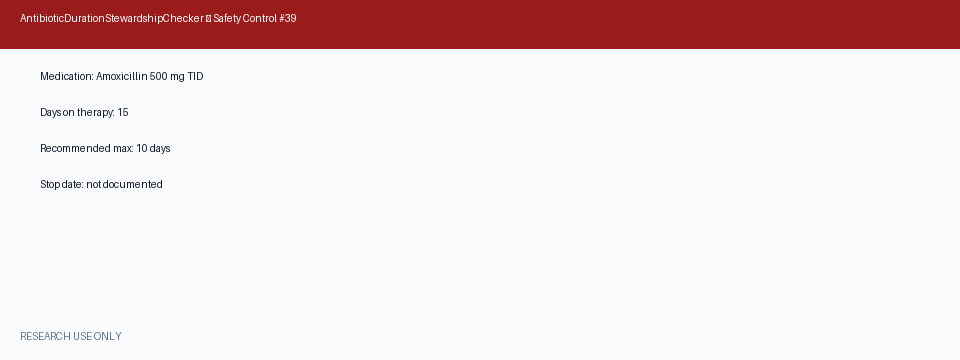

# Antibiotic Duration Stewardship Checker Guide

*medagent-core — Safety Control #39*



## Overview

`AntibioticDurationStewardshipChecker` flags **antibiotic courses exceeding
recommended duration** or **missing a documented stop date** when
`days_on_therapy` is provided. It complements `AntibioticStewardshipChecker`
(fluoroquinolone indication, duplicate coverage, prolonged-course text cues)
by evaluating explicit therapy-day counts against recommended duration cadences.

Findings are advisory `AntibioticDurationRisk` records — **RESEARCH USE ONLY**
— and the checker is exported from `medagent.safety`.

## Finding kinds

| Kind | Trigger | Severity |
|---|---|---|
| `exceeds_recommended_duration` | `days_on_therapy` > recommended maximum | MODERATE (HIGH if &gt;2× max) |
| `missing_stop_date` | `stop_date_provided=False` and `days_on_therapy` ≥ 3 | MODERATE |

Returns **no** findings when `days_on_therapy` is unknown.

## Curated antibiotic panel

| Agent | Default max (days) | Aliases |
|---|---|---|
| amoxicillin | 10 | amoxil |
| azithromycin | 5 | azithro, zithromax |
| cephalexin | 10 | keflex |
| ciprofloxacin | 10 | cipro |
| nitrofurantoin | 7 | macrobid |
| vancomycin | 14 | vancocin |
| … | … | … |

Optional `indication_type` selects shorter ceilings: `uti`/`pneumonia`/`skin`
(7 days), `sinusitis`/`otitis` (10 days), `bacteremia` (14 days).

## Quick start

```python
from medagent.models import Medication
from medagent.safety import AntibioticDurationStewardshipChecker

findings = AntibioticDurationStewardshipChecker().check(
    medications=[
        Medication(name="Amoxicillin 500 mg TID"),
        Medication(name="Azithromycin 250 mg daily"),
    ],
    days_on_therapy=12,
    stop_date_provided=False,
    indication_type="otitis",
)
for finding in findings:
    print(
        finding.agent,
        finding.finding_kind,
        finding.days_on_therapy,
        finding.recommended_max_days,
        finding.severity,
        finding.rationale,
    )
```

## Reasoning stack notes

When this checker's findings are summarized by an upstream reasoning / routing
layer, prefer current frontier models for clinical prose:

- **GPT-5.5**
- **Claude Sonnet 4.6**
- **Gemini 3.x**
- **Kimi K2**

The checker itself is deterministic and does not call an LLM.

## See also

- [SAFETY.md §3.39](../../SAFETY.md)
- [README safety controls table](../../README.md)
- Antibiotic stewardship (text cues): `safety/antibiotic_stewardship_checker.py`
