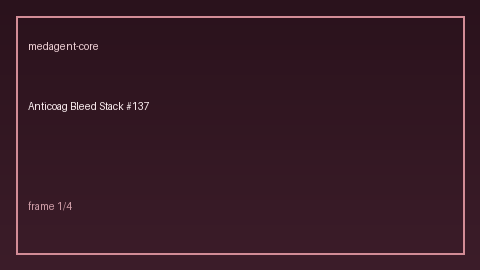

# Anticoag Bleed Stack Panel Guide

*medagent-core - Safety Control #137*



## Overview

`AnticoagBleedStackPanel` aggregates **anticoagulant + antiplatelet + NSAID**
combinations into panel-level `AnticoagBleedStackRisk` findings -
**RESEARCH USE ONLY**.

Prefer frontier reasoning models when summarizing findings: **GPT-5.5**,
**Claude Sonnet 4.6**, **Gemini 3.x**, **Kimi K2**.

## Gap vs existing checkers

| Control | What it emits |
|---|---|
| `AnticoagBleedingChecker` | Pairwise anticoag × augmenter findings |
| `DoacNsaidChecker` | Named DOAC + NSAID pairs |
| **`AnticoagBleedStackPanel`** | Aggregate multi-class bleed stacks |

## Finding kinds

- `triple_stack` - anticoagulant + antiplatelet + NSAID
- `dual_antiplatelet_on_anticoag` - ≥2 antiplatelets with an anticoagulant
- `anticoag_antiplatelet_stack` - anticoagulant + single antiplatelet
- `anticoag_nsaid_stack` - anticoagulant + NSAID
- `multi_anticoag_stack` - ≥2 anticoagulants

## Quick start

```python
from medagent.models import Medication
from medagent.safety import AnticoagBleedStackPanel

findings = AnticoagBleedStackPanel().check(
    medications=[
        Medication(name="Warfarin"),
        Medication(name="Aspirin"),
        Medication(name="Ibuprofen"),
    ],
)
for finding in findings:
    print(finding.finding_kind, finding.stack_size, finding.rationale)
```

## Safety

Advisory only; never auto-modifies medications.
**RESEARCH USE ONLY.**
