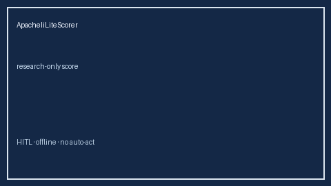

# ApacheIiLiteScorer Guide



Research-only advisory scorer. Closes the MDCalc / SCCM / EHR APACHE II lite score gap.

Optional later polish via **GPT-5.5 / Claude Sonnet 4.6 / Gemini 3.x / Kimi K2**.

Distinct from `SofaOrganFailureScorer` / `QSofaSepsisScreenScorer`.

## Usage

```python
from medagent.safety.apache_ii_lite_scorer import (
    ApacheIiLiteScorer,
    ApacheIiLiteFactors,
)

findings = ApacheIiLiteScorer().check(ApacheIiLiteFactors())
print(findings[0].band, findings[0].rationale)
```

## Safety

RESEARCH USE ONLY. Never modifies medications. No HTTP. See `SAFETY.md` #200.
