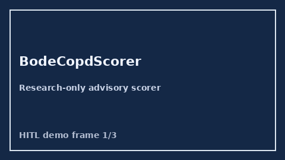

# BodeCopdScorer Guide



Research-only advisory scorer. Closes the MDCalc / GOLD / EHR BODE COPD index score gap.

Optional later polish via **GPT-5.5 / Claude Sonnet 4.6 / Gemini 3.x / Kimi K2**.

Distinct from `SofaOrganFailureScorer` / `Curb65PneumoniaScorer`.

## Usage

```python
from medagent.safety.bode_copd_scorer import (
    BodeCopdScorer,
    BodeCopdFactors,
)

findings = BodeCopdScorer().check(BodeCopdFactors())
print(findings[0].band, findings[0].rationale)
```

## Safety

RESEARCH USE ONLY. Never modifies medications. No HTTP. See `SAFETY.md` #197.
