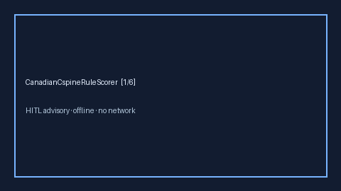

# CanadianCspineRuleScorer Guide



Research-only advisory clinical score. Never modifies medications.
Closes MDCalc / CAEP / EHR Canadian C-spine rule gaps.

Optional polish via **GPT-5.5 / Claude Sonnet 4.6 / Gemini 3.x / Kimi K2**.

Distinct from `OttawaAnkleRuleScorer / FallRiskChecker`.

## Usage

```python
from medagent.safety.canadian_cspine_rule_scorer import (
    CanadianCspineRuleScorer,
    CanadianCspineFactors,
)

findings = CanadianCspineRuleScorer().check(CanadianCspineFactors())
print(findings[0].band, findings[0].score)
```
