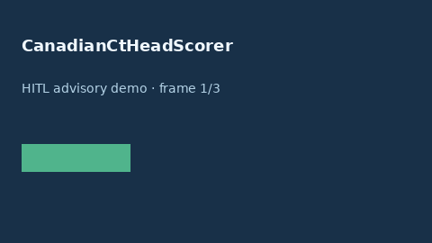

# CanadianCtHeadScorer Guide



Research-only advisory scorer (Safety #216). Never modifies medications.

Gap vs MDCalc / ACEP Canadian CT Head Rule. Distinct from `PecarnHeadTraumaScorer / NexusCspineScorer`.

Optional polish via **GPT-5.5 / Claude Sonnet 4.6 / Gemini 3.x / Kimi K2**.

## Usage

```python
from medagent.safety.canadian_ct_head_scorer import (
    CanadianCtHeadFactors,
    CanadianCtHeadScorer,
)

findings = CanadianCtHeadScorer().check(CanadianCtHeadFactors())
assert "RESEARCH USE ONLY" in findings[0].rationale
print(findings[0].band, findings[0].score)
```

## Safety

RESEARCH USE ONLY. See `SAFETY.md`.
