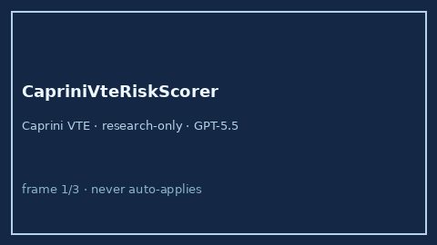

# CapriniVteRiskScorer Guide



Research-only advisory clinical score (Safety #180). Never modifies medications.

Prefer **GPT-5.5 / Claude Sonnet 4.6 / Gemini 3.x / Kimi K2** for narratives.

Distinct from `WellsPeProbabilityScorer / HasBledBleedRiskScorer`.

## Usage

```python
from medagent.safety.caprini_vte_risk_scorer import CapriniVteFactors, CapriniVteRiskScorer

findings = CapriniVteRiskScorer().check(CapriniVteFactors())
assert findings[0].rationale.startswith("RESEARCH USE ONLY")
```
