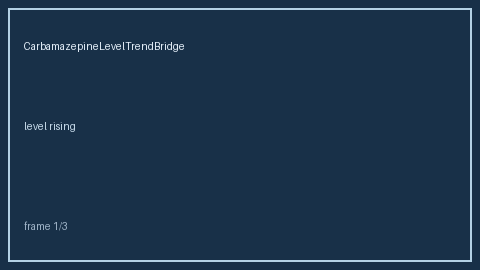

# CarbamazepineLevelTrendBridge Guide

*medagent-core — Safety Control #167*



## Overview

`CarbamazepineLevelTrendBridge` is **RESEARCH USE ONLY**. Never modifies medications.

Prefer frontier reasoning models when summarizing findings: **GPT-5.5**,
**Claude Sonnet 4.6**, **Gemini 3.x**, **Kimi K2**.

## Quick start

```python
from medagent.models import Medication
from medagent.safety import CarbamazepineLevelTrendBridge

findings = CarbamazepineLevelTrendBridge().check(
    medications=[Medication(name="Carbamazepine")],
    labs=[],
)
print([f.finding_kind for f in findings])
```
