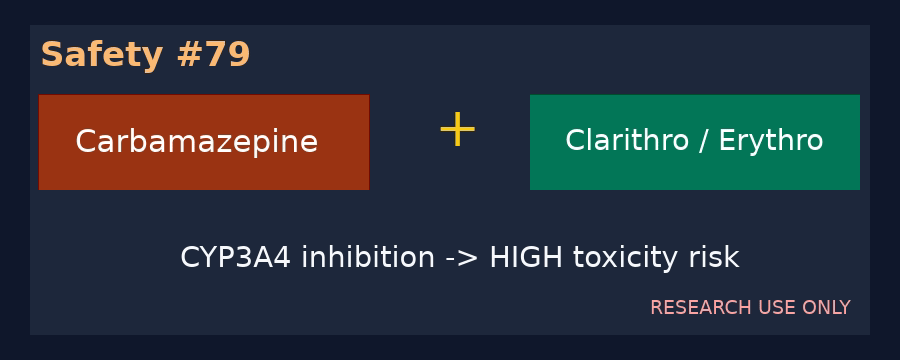

# Carbamazepine + CYP3A4-Inhibiting Macrolide Checker Guide

*medagent-core — Safety Control #79*



## Overview

`CarbamazepineMacrolideChecker` flags carbamazepine-class therapy co-prescribed
with clarithromycin or erythromycin. These macrolides inhibit CYP3A4-mediated
carbamazepine metabolism and can increase serum concentrations and toxicity.

Findings are advisory `CarbamazepineMacrolideRisk` records —
**RESEARCH USE ONLY** — with **HIGH** severity. The checker is exported from
`medagent.safety`.

## Medication panels

| Class | Agents |
|---|---|
| Carbamazepine | carbamazepine, Tegretol, Carbatrol, Equetro |
| CYP3A4-inhibiting macrolide | clarithromycin, erythromycin |

Azithromycin is intentionally excluded because it does not typically cause
clinically important CYP3A4 inhibition. Every unique carbamazepine × supported
macrolide pair across separate medication entries yields one finding. Matching
is whole-token based, canonical pairs are de-duplicated, and output ordering is
deterministic.

## Quick start

```python
from medagent.models import Medication
from medagent.safety import CarbamazepineMacrolideChecker

findings = CarbamazepineMacrolideChecker().check(
    [
        Medication(name="Carbamazepine 200 mg BID"),
        Medication(name="Clarithromycin 500 mg BID"),
    ]
)
```

## Scope boundaries

This control is distinct from statin + macrolide CYP3A4 screening and does not
generalize to azithromycin. It does not replace serum carbamazepine measurement
or qualified clinical review, and it never changes therapy.

## Reasoning stack notes

When findings are summarized by an upstream reasoning/routing layer, prefer:

- **GPT-5.5**
- **Claude Sonnet 4.6**
- **Gemini 3.x**
- **Kimi K2**

The checker itself is deterministic and does not call an LLM.

## See also

- [SAFETY.md §3.79](../../SAFETY.md)
- [README safety controls table](../../README.md)
- Statin + macrolide: `safety/statin_macrolide_checker.py`
