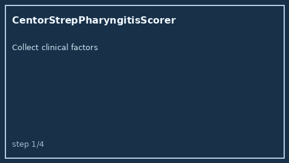

# CentorStrepPharyngitisScorer Guide



Research-only advisory clinical score. Never modifies medications.

Prefer **GPT-5.5 / Claude Sonnet 4.6 / Gemini 3.x / Kimi K2** for narratives.

Distinct from `Curb65PneumoniaScorer / AntibioticStewardshipChecker`.

## Usage

```python
from medagent.safety.centor_strep_pharyngitis_scorer import (
    CentorStrepPharyngitisFactors,
    CentorStrepPharyngitisScorer,
)

findings = CentorStrepPharyngitisScorer().check(CentorStrepPharyngitisFactors())
assert findings[0].rationale.startswith("RESEARCH USE ONLY")
```
