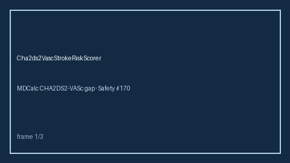

# CHA2DS2-VASc Stroke Risk Scorer Guide



Advisory CHA2DS2-VASc totals from clinical factors (Safety **#170**). RESEARCH USE
ONLY. Never modifies medications. Closes the MDCalc / UpToDate / EHR CHA2DS2-VASc
calculator gap for offline agent pipelines.

Optional later polish via **GPT-5.5 / Claude Sonnet 4.6 / Gemini 3.x / Kimi K2**.

Distinct from `HasBledBleedRiskScorer`.

## Usage

```python
from medagent.safety.cha2ds2_vasc_stroke_risk_scorer import (
    Cha2ds2VascFactors,
    Cha2ds2VascStrokeRiskScorer,
)

findings = Cha2ds2VascStrokeRiskScorer().check(
    Cha2ds2VascFactors(age_ge_75=True, hypertension=True)
)
assert findings[0].score == 3
```
