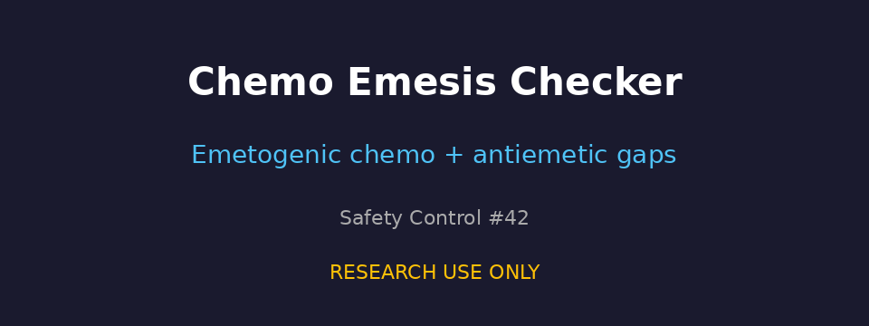

# Chemotherapy Emetogenicity and Antiemetic Prophylaxis Checker Guide

*medagent-core — Safety Control #42*



## Overview

`ChemoEmesisChecker` flags **high/moderate emetogenic chemotherapy** when
**antiemetic prophylaxis cues are missing** from the medication list, or when
`days_since_chemo` suggests the **delayed CINV window** without delayed-phase
antiemetic coverage. It complements lactation chemotherapy flagging and
QT-prolonging antiemetic surveillance with a focused CINV prophylaxis gap check.

Findings are advisory `ChemoEmesisRisk` records — **RESEARCH USE ONLY** —
and the checker is exported from `medagent.safety`.

## Finding kinds

| Kind | Trigger | Severity |
|---|---|---|
| `missing_antiemetic_prophylaxis` | No antiemetic agents on medication list | CRITICAL (high emetogenic) / HIGH (moderate) |
| `delayed_phase_uncovered` | Days 2–5 post-chemo without delayed-phase coverage | HIGH (high emetogenic) / MODERATE (moderate) |

## Emetogenic chemotherapy panel

| Level | Agents |
|---|---|
| high | cisplatin, dacarbazine, ifosfamide |
| moderate | carboplatin, doxorubicin, cyclophosphamide, oxaliplatin |

## Antiemetic prophylaxis panel

| Role | Agents |
|---|---|
| acute / general | ondansetron, granisetron, palonosetron |
| delayed-phase coverage | aprepitant, fosaprepitant, dexamethasone, olanzapine |

Medication matching is whole-token based.

## Quick start

```python
from medagent.models import Medication
from medagent.safety import ChemoEmesisChecker

findings = ChemoEmesisChecker().check(
    medications=[
        Medication(name="Cisplatin 75 mg/m2"),
        Medication(name="Ondansetron 8 mg BID"),
    ],
    days_since_chemo=3,
)
for finding in findings:
    print(
        finding.agent,
        finding.finding_kind,
        finding.emetogenic_level,
        finding.days_since_chemo,
        finding.antiemetic_agents_found,
        finding.severity,
        finding.rationale,
    )
```

## Reasoning stack notes

When this checker's findings are summarized by an upstream reasoning / routing
layer, prefer current frontier models for clinical prose:

- **GPT-5.5**
- **Claude Sonnet 4.6**
- **Gemini 3.x**
- **Kimi K2**

The checker itself is deterministic and does not call an LLM.

## See also

- [SAFETY.md §3.42](../../SAFETY.md)
- [README safety controls table](../../README.md)
- Lactation chemotherapy flagging: `safety/lactation_checker.py`
