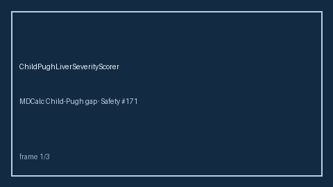

# Child-Pugh Liver Severity Scorer Guide



Advisory Child-Pugh totals and class A/B/C (Safety **#171**). RESEARCH USE ONLY.
Never modifies medications. Closes the MDCalc / UpToDate / EHR Child-Pugh
calculator gap for offline agent pipelines.

Optional later polish via **GPT-5.5 / Claude Sonnet 4.6 / Gemini 3.x / Kimi K2**.

Distinct from `HasBledBleedRiskScorer` and `Cha2ds2VascStrokeRiskScorer`.

## Usage

```python
from medagent.safety.child_pugh_liver_severity_scorer import (
    ChildPughFactors,
    ChildPughLiverSeverityScorer,
)

findings = ChildPughLiverSeverityScorer().check(
    ChildPughFactors(bilirubin_points=2, albumin_points=2, inr_points=2)
)
assert findings[0].child_class in {"A", "B", "C"}
```
