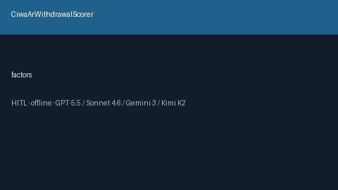

# CiwaArWithdrawalScorer Guide



Research-only advisory scorer (Safety #204). Never modifies medications.

Gap vs MDCalc / ASAM / EHR CIWA-Ar alcohol withdrawal score. Distinct from `GcsNeurologicStatusScorer / FallRiskChecker`.

Optional polish via **GPT-5.5 / Claude Sonnet 4.6 / Gemini 3.x / Kimi K2**.

## Usage

```python
from medagent.safety.ciwa_ar_withdrawal_scorer import (
    CiwaArWithdrawalFactors,
    CiwaArWithdrawalScorer,
)

findings = CiwaArWithdrawalScorer().check(CiwaArWithdrawalFactors())
assert "RESEARCH USE ONLY" in findings[0].rationale
print(findings[0].band, findings[0].score)
```

## Safety

RESEARCH USE ONLY. See `SAFETY.md`.
