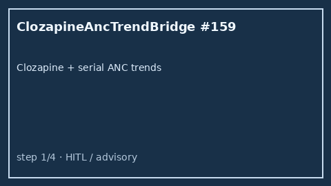

# Clozapine ANC Trend Bridge Guide

*medagent-core — Safety Control #159*



## Overview

`ClozapineAncTrendBridge` combines **clozapine** exposure with serial **ANC**
(absolute neutrophil count) values showing declining or low trends into
REMS-style advisory `ClozapineAncTrendAlert` findings — **RESEARCH USE ONLY**.
Never modifies medications.

Prefer frontier reasoning models when summarizing findings: **GPT-5.5**,
**Claude Sonnet 4.6**, **Gemini 3.x**, **Kimi K2**.

## Gap vs related controls

| Control | What it requires |
|---|---|
| `ClozapineAncChecker` | Clozapine present → single-threshold ANC monitoring reminder |
| `ClozapineCyp1a2Checker` | Clozapine × CYP1A2 interaction pairs |
| **`ClozapineAncTrendBridge`** | Clozapine **plus** serial declining/low ANC trends |

## Finding kinds

- `declining_anc_on_clozapine` — declining serial ANC series
- `low_anc_on_clozapine` — latest ANC <1500 cells/µL (not yet <1000)
- `critical_low_anc_on_clozapine` — latest ANC <1000 cells/µL
- `clozapine_anc_rems_advisory` — aggregate REMS-style advisory

## Quick start

```python
from medagent.models import Medication
from medagent.safety import ClozapineAncTrendBridge

findings = ClozapineAncTrendBridge().check(
    medications=[Medication(name="Clozapine")],
    labs=[
        {"name": "ANC", "value": 2800.0, "drawn_at": "2026-01-01"},
        {"name": "ANC", "value": 1400.0, "drawn_at": "2026-01-15"},
    ],
)
for finding in findings:
    print(finding.finding_kind, finding.severity, finding.rationale)
```

## Safety

Advisory only; never auto-modifies medications.
**RESEARCH USE ONLY.** See `SAFETY.md` §3.159.
