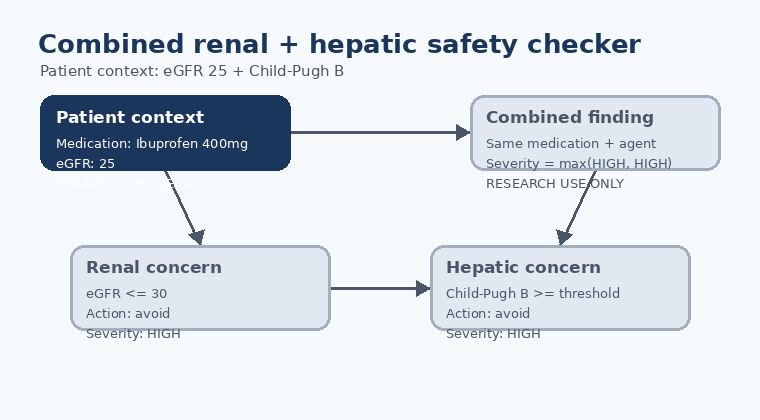

# Combined Renal + Hepatic Checker Guide

*medagent-core — Safety Control #24*



## Overview

`CombinedRenalHepaticChecker` flags active medications that trigger **both** the
renal-dose (eGFR) checker and the hepatic-dose (Child-Pugh) checker for the same
patient context.

It complements the standalone organ-function checkers by surfacing the dual
impairment alert pattern used by clinical decision support systems such as First
Databank and Lexicomp: a finding is emitted only when the **same medication and
canonical agent** has both renal and hepatic concerns.

Findings are advisory `CombinedRenalHepaticRisk` records — RESEARCH USE ONLY —
and the checker is standalone (not exported from `safety/__init__.py` or wired
into the orchestrator).

## How findings are composed

| Step | Rule |
|---|---|
| Renal component | Run `RenalDoseChecker.check(medications, egfr)` |
| Hepatic component | Run `HepaticDoseChecker.check(medications, hepatic_function)` |
| Join key | Same `medication` display name and same canonical `agent` |
| Severity | Maximum of renal and hepatic component severities |
| Missing data | Unknown eGFR or unknown Child-Pugh class returns no combined findings |

Matching stays deterministic because the component checkers already use
whole-token medication matching and stable severity/name ordering.

## Quick start

```python
from medagent.models import HepaticFunction, Medication
from medagent.safety.combined_renal_hepatic_checker import CombinedRenalHepaticChecker

findings = CombinedRenalHepaticChecker().check(
    medications=[
        Medication(name="Ibuprofen 400mg"),
        Medication(name="Rivaroxaban 20mg"),
    ],
    egfr=25.0,
    hepatic_function=HepaticFunction.MODERATE,
)
for finding in findings:
    print(
        finding.agent,
        finding.renal_action,
        finding.hepatic_action,
        finding.severity,
        finding.rationale,
    )
```

## Reasoning stack notes

When this checker’s findings are summarized by an upstream reasoning / routing
layer, prefer current frontier models for clinical prose:

- **GPT-5.5**
- **Claude Sonnet 4.6**
- **Gemini 2.5**
- **Kimi K2**

The checker itself is deterministic and does not call an LLM.

## See also

- [SAFETY.md §3.24](../../SAFETY.md)
- [README safety controls table](../../README.md)
- [CHANGELOG](../../CHANGELOG.md)
- Renal-dose checker: `safety/renal_dose_checker.py`
- Hepatic-dose checker: `safety/hepatic_dose_checker.py`
