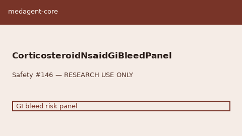

# Corticosteroid + NSAID GI Bleed Panel Guide

*medagent-core — Safety Control #146*



## Overview

`CorticosteroidNsaidGiBleedPanel` aggregates concurrent **systemic corticosteroid
+ NSAID** into panel-level `CorticosteroidNsaidGiBleedRisk` findings —
**RESEARCH USE ONLY**. Never modifies medications.

Prefer frontier reasoning models when summarizing findings: **GPT-5.5**,
**Claude Sonnet 4.6**, **Gemini 3.x**, **Kimi K2**.

## Gap vs related checkers

| Control | Focus |
|---|---|
| `FluoroquinoloneCorticosteroidChecker` | FQ × steroid **tendon** risk |
| `NsaidSsriBleedChecker` | NSAID × SSRI/SNRI bleeding |
| **`CorticosteroidNsaidGiBleedPanel`** | Systemic steroid × NSAID **GI bleed** panel |

## Finding kinds

- `corticosteroid_nsaid_gi_bleed` — ≥1 steroid + ≥1 NSAID
- `multi_nsaid_on_corticosteroid` — ≥2 NSAIDs with steroid
- `multi_steroid_nsaid_stack` — ≥2 steroids with NSAID

## Quick start

```python
from medagent.models import Medication
from medagent.safety import CorticosteroidNsaidGiBleedPanel

findings = CorticosteroidNsaidGiBleedPanel().check(
    medications=[
        Medication(name="Prednisone"),
        Medication(name="Ibuprofen"),
    ],
)
for finding in findings:
    print(finding.finding_kind, finding.severity, finding.rationale)
```

## Safety

Advisory only; never auto-modifies medications.
**RESEARCH USE ONLY.** See `SAFETY.md` §3.146.
