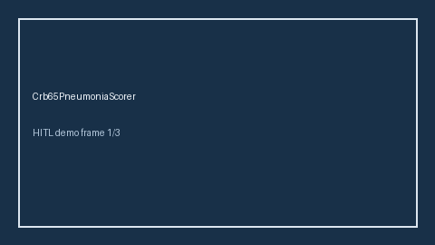

# Crb65PneumoniaScorer Guide



Research-only advisory scorer (Safety #207). Never modifies medications.

Gap vs MDCalc / BTS / EHR CRB-65 pneumonia score. Distinct from `Curb65PneumoniaScorer / PsiPortPneumoniaScorer`.

Optional polish via **GPT-5.5 / Claude Sonnet 4.6 / Gemini 3.x / Kimi K2**.

## Usage

```python
from medagent.safety.crb65_pneumonia_scorer import (
    Crb65PneumoniaFactors,
    Crb65PneumoniaScorer,
)

findings = Crb65PneumoniaScorer().check(Crb65PneumoniaFactors())
assert "RESEARCH USE ONLY" in findings[0].rationale
print(findings[0].band, findings[0].score)
```

## Safety

RESEARCH USE ONLY. See `SAFETY.md`.
