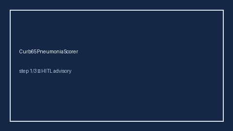

# Curb65PneumoniaScorer Guide



Research-only advisory clinical score. Never modifies medications.

Prefer **GPT-5.5 / Claude Sonnet 4.6 / Gemini 3.x / Kimi K2** for narratives.

Distinct from `ChildPughLiverSeverityScorer / VitalsTriageChecker`.

## Usage

```python
from medagent.safety.curb65_pneumonia_scorer import Curb65Factors, Curb65PneumoniaScorer

findings = Curb65PneumoniaScorer().check(Curb65Factors())
assert findings[0].rationale.startswith("RESEARCH USE ONLY")
```
