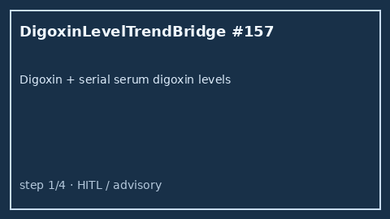

# Digoxin Level Trend Bridge Guide

*medagent-core — Safety Control #157*



## Overview

`DigoxinLevelTrendBridge` combines **digoxin** exposure with serial **serum
digoxin level** values showing rising, elevated, or clearly
supratherapeutic trends into advisory `DigoxinLevelTrendAlert` findings —
**RESEARCH USE ONLY**. Never modifies medications.

Prefer frontier reasoning models when summarizing findings: **GPT-5.5**,
**Claude Sonnet 4.6**, **Gemini 3.x**, **Kimi K2**.

## Gap vs related controls

| Control | What it requires |
|---|---|
| `DigoxinToxicityChecker` | Digoxin + electrolyte / loop-diuretic toxicity cues |
| `DigoxinAmioChecker` | Digoxin × amiodarone DDI / level-monitoring pairs |
| **`DigoxinLevelTrendBridge`** | Digoxin **plus** serial serum digoxin level trends |

## Finding kinds

- `rising_digoxin_level` — rising serial serum digoxin series
- `elevated_digoxin_level` — latest level ≥1.2 ng/mL (not yet ≥2.0)
- `supratherapeutic_digoxin_level` — latest level ≥2.0 ng/mL
- `digoxin_level_monitoring_advisory` — aggregate advisory

## Quick start

```python
from medagent.models import Medication
from medagent.safety import DigoxinLevelTrendBridge

findings = DigoxinLevelTrendBridge().check(
    medications=[Medication(name="Digoxin")],
    labs=[
        {"name": "serum digoxin", "value": 0.8, "drawn_at": "2026-01-01"},
        {"name": "serum digoxin", "value": 1.6, "drawn_at": "2026-01-15"},
    ],
)
for finding in findings:
    print(finding.finding_kind, finding.severity, finding.rationale)
```

## Safety

Advisory only; never auto-modifies medications.
**RESEARCH USE ONLY.** See `SAFETY.md` §3.157.
