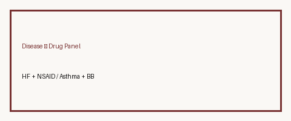

# Disease Contraindication Checker Guide

*medagent-core — Safety Control #129*



## Overview

`DiseaseContraindicationChecker` flags curated **condition × medication**
educational contraindications (for example heart failure + NSAIDs, asthma +
nonselective beta-blockers). Matching is whole-token based. Findings are
advisory `DiseaseContraindicationRisk` records — **RESEARCH USE ONLY**.

Prefer frontier reasoning models when summarizing findings: **GPT-5.5**,
**Claude Sonnet 4.6**, **Gemini 3.x**, **Kimi K2**.

## Gap vs MedPrompt condition×drug checks

MedPrompt-style prompts may ask an LLM to recall disease–drug cautions in free
text. This control provides a **deterministic, auditable panel** of well-known
condition×drug heuristics — complementary to LLM narratives and **not** another
pairwise drug–drug interaction checker.

## Curated panels

| Panel ID | Condition | Agents (examples) | Severity |
|---|---|---|---|
| hf_nsaid | heart failure / CHF | ibuprofen, naproxen, diclofenac, ketorolac, ... | HIGH |
| asthma_nonselective_bb | asthma | propranolol, nadolol, timolol, sotalol, carvedilol | HIGH |
| parkinson_dopamine_blockers | Parkinson disease | metoclopramide, prochlorperazine, promethazine, haloperidol | HIGH |
| gout_thiazide | gout | hydrochlorothiazide, chlorthalidone, indapamide | MODERATE |
| mg_aminoglycoside | myasthenia gravis | gentamicin, tobramycin, amikacin | HIGH |
| ckd_nsaid | CKD / chronic kidney disease | ibuprofen, naproxen, ketorolac, ... | HIGH |

## Quick start

```python
from medagent.models import Medication
from medagent.safety import DiseaseContraindicationChecker

findings = DiseaseContraindicationChecker().check(
    conditions=["Heart failure", "Asthma"],
    medications=[
        Medication(name="Ibuprofen 400mg"),
        Medication(name="Propranolol 40mg"),
    ],
)
for finding in findings:
    print(finding.panel_id, finding.agent, finding.severity, finding.rationale)
```

## Safety

Advisory only; never auto-modifies medications. **RESEARCH USE ONLY.**
