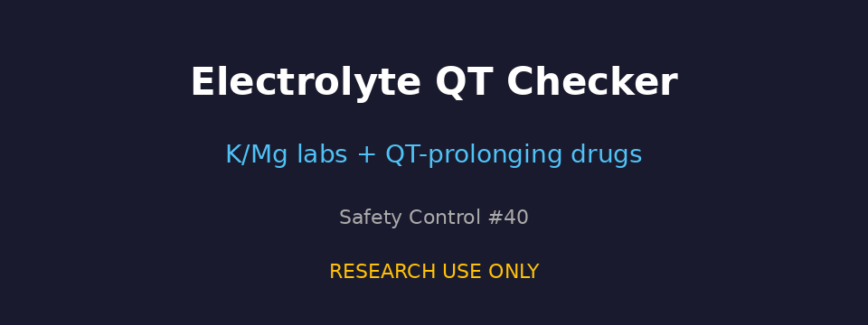

# Electrolyte Panel (K/Mg) with QT Drug Checker Guide

*medagent-core — Safety Control #40*



## Overview

`ElectrolyteQtChecker` flags **QT-prolonging medications** when **potassium or
magnesium laboratory values are missing or below conservative thresholds**
(K &lt; 3.5 mmol/L, Mg &lt; 1.7 mg/dL). It complements `QtProlongationChecker`
(additive QT drug count) and `QtcMonitoringChecker` (ECG surveillance cadence)
by evaluating electrolyte status against QT-prolonging agents.

Findings are advisory `ElectrolyteQtRisk` records — **RESEARCH USE ONLY** —
and the checker is exported from `medagent.safety`.

## Finding kinds

| Kind | Trigger | Severity |
|---|---|---|
| `missing_electrolytes` | Potassium and/or magnesium not documented | MODERATE |
| `low_potassium` | K &lt; 3.5 mmol/L | HIGH |
| `low_magnesium` | Mg &lt; 1.7 mg/dL | HIGH |

## Curated QT-prolonging panel

| Agent | Notes |
|---|---|
| methadone | opioid with QT activity |
| ondansetron | 5-HT3 antiemetic |
| azithromycin | macrolide antibiotic |
| amiodarone | class III antiarrhythmic |
| haloperidol | typical antipsychotic |
| citalopram / escitalopram | SSRIs |
| sotalol / dofetilide | class III antiarrhythmics |

Medication matching is whole-token based.

## Quick start

```python
from medagent.models import Medication
from medagent.safety import ElectrolyteQtChecker

findings = ElectrolyteQtChecker().check(
    medications=[
        Medication(name="Amiodarone 200 mg daily"),
        Medication(name="Ondansetron 4 mg PRN"),
    ],
    potassium_mmol_l=3.2,
    magnesium_mg_dl=1.5,
)
for finding in findings:
    print(
        finding.agent,
        finding.finding_kind,
        finding.potassium_mmol_l,
        finding.magnesium_mg_dl,
        finding.severity,
        finding.rationale,
    )
```

## Reasoning stack notes

When this checker's findings are summarized by an upstream reasoning / routing
layer, prefer current frontier models for clinical prose:

- **GPT-5.5**
- **Claude Sonnet 4.6**
- **Gemini 3.x**
- **Kimi K2**

The checker itself is deterministic and does not call an LLM.

## See also

- [SAFETY.md §3.40](../../SAFETY.md)
- [README safety controls table](../../README.md)
- QT prolongation (additive count): `safety/qt_prolongation_checker.py`
- QTc monitoring cadence: `safety/qtc_monitoring_checker.py`
