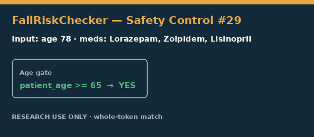

# Fall-Risk Medication Checker Guide

*medagent-core — Safety Control #30*



## Overview

`FallRiskChecker` flags a conservative educational panel of medications that
increase fall and fracture risk in adults aged 65 and older — benzodiazepines,
Z-drug hypnotics, a curated anticholinergic subset, antipsychotics, muscle
relaxants, and peripheral alpha-1 blockers. It complements Beers Criteria,
anticholinergic-burden scoring, STOPP/START, and geriatric deprescribing by
focusing specifically on fall-risk mechanisms rather than general PIM status.

Findings are advisory `FallRiskFinding` records — **RESEARCH USE ONLY** — and
the checker is exported from `medagent.safety`.

## Curated mini panel

| Category | Agents | Typical severity |
|---|---|---|
| Benzodiazepine | alprazolam, lorazepam, diazepam, clonazepam, temazepam, chlordiazepoxide, flurazepam, oxazepam | HIGH |
| Z-drug hypnotic | zolpidem, eszopiclone, zaleplon | HIGH / MODERATE |
| Anticholinergic subset | diphenhydramine, hydroxyzine, oxybutynin, tolterodine, amitriptyline, doxepin | HIGH / MODERATE |
| Antipsychotic | haloperidol, risperidone, olanzapine, quetiapine | HIGH |
| Muscle relaxant | cyclobenzaprine, carisoprodol, methocarbamol | HIGH / MODERATE |
| Alpha-1 blocker | doxazosin, prazosin, terazosin | MODERATE |

The checker is gated by `patient_age >= 65` and returns no findings when age is
under 65 or unknown. Medication matching is whole-token based:
`Lorazepamfree` and `Zolpidemoid` are ignored, while `Lorazepam 0.5mg` matches.

## Quick start

```python
from medagent.models import Medication
from medagent.safety import FallRiskChecker

findings = FallRiskChecker().check(
    medications=[
        Medication(name="Lorazepam 0.5mg nightly"),
        Medication(name="Zolpidem tartrate 5mg"),
        Medication(name="Lisinopril 10mg"),
    ],
    patient_age=78,
)
for finding in findings:
    print(finding.agent, finding.risk_category, finding.severity, finding.rationale)
```

## Reasoning stack notes

When this checker’s findings are summarized by an upstream reasoning / routing
layer, prefer current frontier models for clinical prose:

- **GPT-5.5**
- **Claude Sonnet 4.6**
- **Gemini 3.x**
- **Kimi K2**

The checker itself is deterministic and does not call an LLM.

## See also

- [SAFETY.md section 3.29](../../SAFETY.md)
- [README safety controls table](../../README.md)
- Beers Criteria: `safety/beers_criteria_checker.py`
- Anticholinergic burden: `safety/anticholinergic_burden_checker.py`
- Geriatric deprescribing: `safety/geriatric_deprescribing_checker.py`
