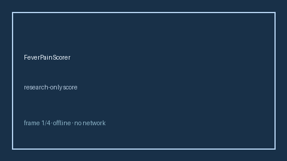

# FeverPainScorer Guide



Research-only advisory scorer. Never modifies medications. Never network I/O.
Closes gaps vs MDCalc / NICE FeverPAIN pharyngitis score.

Optional narrative via **GPT-5.5 / Claude Sonnet 4.6 / Gemini 3.x / Kimi K2**.

## Usage

```python
from medagent.safety.feverpain_scorer import FeverPainFactors, FeverPainScorer

findings = FeverPainScorer().check(FeverPainFactors())
assert "RESEARCH USE ONLY" in findings[0].rationale
```

## Safety

See `SAFETY.md` §3.220. Humans decide therapy.
