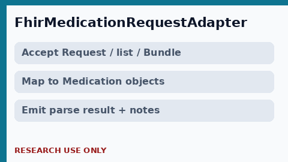

# FHIR MedicationRequest Adapter Guide

*medagent-core - Safety Control #135*



## Overview

`FhirMedicationRequestAdapter` is a **thin safety-panel adapter** that maps
FHIR MedicationRequest-like dicts (single resource, list, or Bundle entries)
into `Medication` objects plus a `FhirMedicationParseResult` with rationale
notes - **RESEARCH USE ONLY**.

Prefer frontier reasoning models when summarizing findings: **GPT-5.5**,
**Claude Sonnet 4.6**, **Gemini 3.x**, **Kimi K2**.

## Gap vs extraction.fhir_parser

`extraction/fhir_parser.py` parses a **full FHIR Bundle** into
`FHIRPatientContext` (patient, conditions, meds, labs, allergies). This adapter
only maps MedicationRequest-like resources for safety-panel inputs and does not
redo full-bundle parsing.

## Accepted shapes

- Single `MedicationRequest` dict
- List of MedicationRequest-like dicts
- `Bundle` with `entry[].resource`
- `{"MedicationRequest": [...]}` keyed dict

## Quick start

```python
from medagent.safety import FhirMedicationRequestAdapter

result = FhirMedicationRequestAdapter().adapt(
    {
        "resourceType": "MedicationRequest",
        "status": "active",
        "medicationCodeableConcept": {"text": "Amoxicillin 500mg"},
        "dosageInstruction": [{"text": "500 mg", "timing": {"code": {"text": "BID"}}}],
    }
)
print(result.medications, result.rationale)
```

## Safety

Adapter output is for research safety panels only - not a clinical order.
**RESEARCH USE ONLY.**
