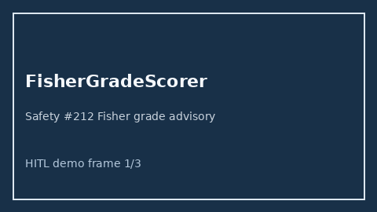

# FisherGradeScorer Guide



Research-only advisory scorer (Safety #212). Never modifies medications.

Gap vs MDCalc / AHA Fisher grade. Distinct from `HuntHessSahScorer / WfnsSahScorer`.

Optional polish via **GPT-5.5 / Claude Sonnet 4.6 / Gemini 3.x / Kimi K2**.

## Usage

```python
from medagent.safety.fisher_grade_scorer import (
    FisherGradeFactors,
    FisherGradeScorer,
)

findings = FisherGradeScorer().check(FisherGradeFactors())
assert "RESEARCH USE ONLY" in findings[0].rationale
print(findings[0].band, findings[0].score)
```

## Safety

RESEARCH USE ONLY. See `SAFETY.md`.
