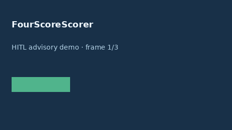

# FourScoreScorer Guide



Research-only advisory scorer (Safety #214). Never modifies medications.

Gap vs MDCalc / Neurocritical Care FOUR score. Distinct from `GcsNeurologicStatusScorer / WfnsSahScorer`.

Optional polish via **GPT-5.5 / Claude Sonnet 4.6 / Gemini 3.x / Kimi K2**.

## Usage

```python
from medagent.safety.four_score_scorer import (
    FourScoreFactors,
    FourScoreScorer,
)

findings = FourScoreScorer().check(FourScoreFactors())
assert "RESEARCH USE ONLY" in findings[0].rationale
print(findings[0].band, findings[0].score)
```

## Safety

RESEARCH USE ONLY. See `SAFETY.md`.
