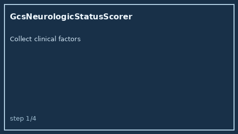

# GcsNeurologicStatusScorer Guide



Research-only advisory clinical score. Never modifies medications.

Prefer **GPT-5.5 / Claude Sonnet 4.6 / Gemini 3.x / Kimi K2** for narratives.

Distinct from `HeartScoreAcsScorer / VitalsTriageChecker`.

## Usage

```python
from medagent.safety.gcs_neurologic_status_scorer import (
    GcsNeurologicStatusFactors,
    GcsNeurologicStatusScorer,
)

findings = GcsNeurologicStatusScorer().check(GcsNeurologicStatusFactors())
assert findings[0].rationale.startswith("RESEARCH USE ONLY")
```
