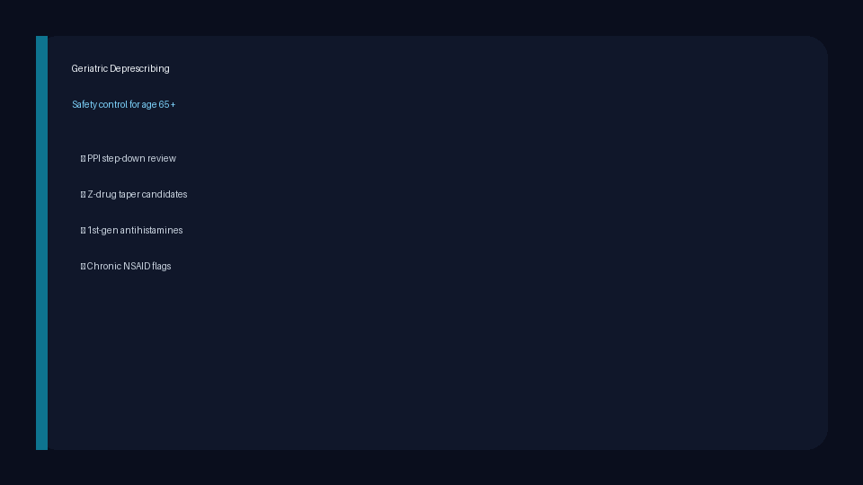

# Geriatric Deprescribing Checker Guide

*medagent-core — Safety Control #25*



## Overview

`GeriatricDeprescribingChecker` flags curated medication patterns that are
commonly reviewed as deprescribing, taper, step-down, or substitution
opportunities in adults aged **65 and older**. It complements Beers Criteria and
STOPP/START by focusing on supervised deprescribing review opportunities rather
than reproducing their formal potentially-inappropriate-medication or
prescribing-omission logic.

Findings are advisory `GeriatricDeprescribingRisk` records — **RESEARCH USE
ONLY**, educational/demo catalog, not clinical advice — and the checker is
exported from `medagent.safety`.

## Curated mini rule set

| Category | Triggers when |
|---|---|
| Long-term PPI without clear ongoing indication | Scheduled/chronic omeprazole, pantoprazole, esomeprazole, lansoprazole, rabeprazole, or dexlansoprazole unless a protective indication is documented |
| Sedative-hypnotic deprescribing candidate | Z-drug hypnotic (zolpidem, zaleplon, eszopiclone) |
| First-generation antihistamine deprescribing candidate | Diphenhydramine, doxylamine, hydroxyzine, or chlorpheniramine |
| Chronic NSAID deprescribing candidate | Scheduled/chronic ibuprofen, naproxen, diclofenac, meloxicam, or indomethacin |

Matching is whole-token for medications. PPI findings are suppressed when the
optional indication text includes examples such as Barrett esophagus, erosive
esophagitis, prior GI bleed, peptic ulcer, gastroprotection, or Zollinger-Ellison
syndrome. Patients under 65 (or unknown age) yield no findings.

## Quick start

```python
from medagent.models import Medication
from medagent.safety import GeriatricDeprescribingChecker

findings = GeriatricDeprescribingChecker().check(
    medications=[
        Medication(name="Omeprazole 20mg", frequency="daily"),
        Medication(name="Zolpidem 5mg"),
    ],
    age=78,
    indications=["GERD symptoms resolved"],
)
for finding in findings:
    print(
        finding.agent,
        finding.deprescribing_category,
        finding.taper_candidate,
        finding.severity,
        finding.suggested_action,
    )
```

## Reasoning stack notes

When this checker’s findings are summarized by an upstream reasoning / routing
layer, prefer current frontier models for clinical prose:

- **GPT-5.5**
- **Claude Sonnet 4.6**
- **Gemini 3.x**
- **Kimi K2**

The checker itself is deterministic and does not call an LLM.

## See also

- [SAFETY.md §3.25](../../SAFETY.md)
- [README safety controls table](../../README.md)
- Beers Criteria: `safety/beers_criteria_checker.py`
- STOPP/START: `safety/stopp_start_checker.py`
