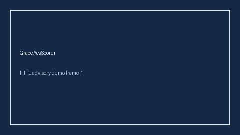

# GraceAcsScorer Guide



Research-only advisory scorer (Safety #209). Never modifies medications.

Gap vs MDCalc / ACC / EHR GRACE ACS risk. Distinct from `KillipClassScorer / HeartScoreAcsScorer / TimiUaNstemiScorer`.

Optional polish via **GPT-5.5 / Claude Sonnet 4.6 / Gemini 3.x / Kimi K2**.

## Usage

```python
from medagent.safety.grace_acs_scorer import (
    GraceAcsFactors,
    GraceAcsScorer,
)

findings = GraceAcsScorer().check(GraceAcsFactors())
assert "RESEARCH USE ONLY" in findings[0].rationale
print(findings[0].band, findings[0].score)
```

## Safety

RESEARCH USE ONLY. See `SAFETY.md`.
