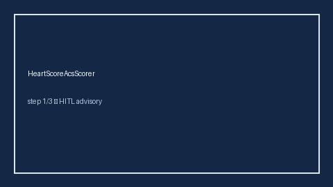

# HeartScoreAcsScorer Guide



Research-only advisory clinical score. Never modifies medications.

Prefer **GPT-5.5 / Claude Sonnet 4.6 / Gemini 3.x / Kimi K2** for narratives.

Distinct from `Cha2ds2VascStrokeRiskScorer / HasBledBleedRiskScorer`.

## Usage

```python
from medagent.safety.heart_score_acs_scorer import HeartScoreFactors, HeartScoreAcsScorer

findings = HeartScoreAcsScorer().check(HeartScoreFactors())
assert findings[0].rationale.startswith("RESEARCH USE ONLY")
```
