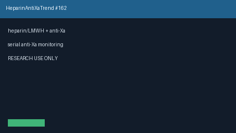

# Heparin Anti-Xa Trend Bridge Guide

*medagent-core — Safety Control #162*



## Overview

`HeparinAntiXaTrendBridge` combines **heparin / UFH / LMWH** exposure with
serial **anti-Xa** levels showing rising, elevated, subtherapeutic, or clearly
supratherapeutic trends into advisory `HeparinAntiXaTrendAlert` findings —
**RESEARCH USE ONLY**. Never modifies medications.

Prefer frontier reasoning models when summarizing findings: **GPT-5.5**,
**Claude Sonnet 4.6**, **Gemini 3.x**, **Kimi K2**.

## Gap vs related controls

| Control | What it requires |
|---|---|
| `HeparinPlateletTrendBridge` | Heparin/LMWH + falling platelet HIT-risk trends |
| **`HeparinAntiXaTrendBridge`** | Heparin/LMWH **plus** serial anti-Xa levels |

## Finding kinds

- `rising_antixa_on_heparin` — rising serial anti-Xa series
- `elevated_antixa_on_heparin` — latest anti-Xa ≥1.0 IU/mL (not yet ≥1.5)
- `supratherapeutic_antixa_on_heparin` — latest anti-Xa ≥1.5 IU/mL
- `subtherapeutic_antixa_on_heparin` — falling/subtherapeutic anti-Xa
- `heparin_antixa_monitoring_advisory` — aggregate advisory

## Quick start

```python
from medagent.models import Medication
from medagent.safety import HeparinAntiXaTrendBridge

findings = HeparinAntiXaTrendBridge().check(
    medications=[Medication(name="Enoxaparin")],
    labs=[
        {"name": "anti-xa", "value": 0.6, "drawn_at": "2026-01-01"},
        {"name": "anti-xa", "value": 1.3, "drawn_at": "2026-01-03"},
    ],
)
for finding in findings:
    print(finding.finding_kind, finding.severity, finding.rationale)
```

## Safety

Advisory only; never auto-modifies medications.
**RESEARCH USE ONLY.** See `SAFETY.md` §3.162.
