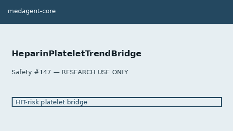

# Heparin Platelet Trend Bridge Guide

*medagent-core — Safety Control #147*



## Overview

`HeparinPlateletTrendBridge` combines **heparin / UFH / LMWH** exposure with
serial platelet counts into advisory `HeparinPlateletTrendAlert` HIT-risk cues —
**RESEARCH USE ONLY**. Never modifies medications.

Prefer frontier reasoning models when summarizing findings: **GPT-5.5**,
**Claude Sonnet 4.6**, **Gemini 3.x**, **Kimi K2**.

## Gap vs LabTrendAlertBridge

| Control | What it requires |
|---|---|
| `LabTrendAlertBridge` | Serial platelets only (drug-agnostic) |
| **`HeparinPlateletTrendBridge`** | Heparin-class exposure **plus** falling platelet trend |

## Finding kinds

- `falling_platelets_on_heparin` — declining platelets on UFH/heparin
- `falling_platelets_on_lmwh` — declining platelets on LMWH
- `hit_risk_platelet_decline` — ≥50% drop or fall into low range on heparin-class agent
- `heparin_exposure_platelet_trend` — residual exposure+trend cue

## Quick start

```python
from medagent.models import Medication
from medagent.safety import HeparinPlateletTrendBridge

findings = HeparinPlateletTrendBridge().check(
    medications=[Medication(name="Heparin")],
    labs=[
        {"name": "platelets", "value": 220, "drawn_at": "2026-01-01"},
        {"name": "platelets", "value": 90, "drawn_at": "2026-01-05"},
    ],
)
for finding in findings:
    print(finding.finding_kind, finding.severity, finding.rationale)
```

## Safety

Advisory only; never auto-modifies medications.
**RESEARCH USE ONLY.** See `SAFETY.md` §3.147.
