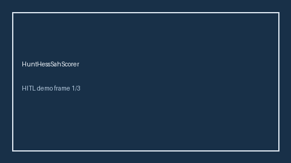

# HuntHessSahScorer Guide



Research-only advisory scorer (Safety #205). Never modifies medications.

Gap vs MDCalc / AHA / EHR Hunt-Hess SAH grade. Distinct from `NihssStrokeScorer / GcsNeurologicStatusScorer`.

Optional polish via **GPT-5.5 / Claude Sonnet 4.6 / Gemini 3.x / Kimi K2**.

## Usage

```python
from medagent.safety.hunt_hess_sah_scorer import (
    HuntHessSahFactors,
    HuntHessSahScorer,
)

findings = HuntHessSahScorer().check(HuntHessSahFactors())
assert "RESEARCH USE ONLY" in findings[0].rationale
print(findings[0].band, findings[0].score)
```

## Safety

RESEARCH USE ONLY. See `SAFETY.md`.
