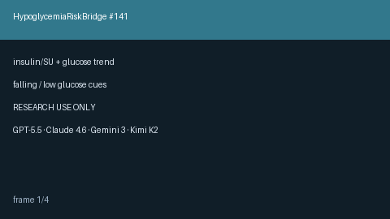

# Hypoglycemia Risk Bridge Guide



Combine **insulin / sulfonylurea** agents with serial glucose draws into
advisory hypoglycemia risk cues. RESEARCH USE ONLY — never modifies medications.

Distinct from `LabCriticalValueChecker` (single-draw) and `LabTrendAlertBridge`
(non-glucose analytes).

Optional narrative polish via **GPT-5.5 / Claude Sonnet 4.6 / Gemini 3.x / Kimi K2**.

## Usage

```python
from medagent.models import Medication
from medagent.safety import HypoglycemiaRiskBridge

findings = HypoglycemiaRiskBridge().check(
    medications=[Medication(name="Insulin glargine")],
    labs=[
        {"name": "glucose", "value": 140, "unit": "mg/dL", "drawn_at": "t1"},
        {"name": "glucose", "value": 65, "unit": "mg/dL", "drawn_at": "t2"},
    ],
)
for finding in findings:
    print(finding.finding_kind, finding.severity, finding.rationale)
```

## Safety

Educational / research use only. Not a prescription. See `SAFETY.md` §3.141.
