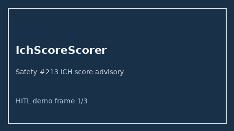

# IchScoreScorer Guide



Research-only advisory scorer (Safety #213). Never modifies medications.

Gap vs MDCalc / AHA ICH score. Distinct from `WfnsSahScorer / HuntHessSahScorer / NihssStrokeScorer`.

Optional polish via **GPT-5.5 / Claude Sonnet 4.6 / Gemini 3.x / Kimi K2**.

## Usage

```python
from medagent.safety.ich_score_scorer import (
    IchScoreFactors,
    IchScoreScorer,
)

findings = IchScoreScorer().check(IchScoreFactors())
assert "RESEARCH USE ONLY" in findings[0].rationale
print(findings[0].band, findings[0].score)
```

## Safety

RESEARCH USE ONLY. See `SAFETY.md`.
