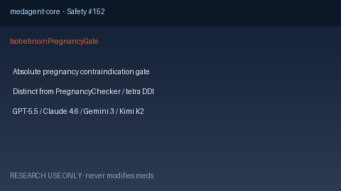

# Isotretinoin Pregnancy Gate Guide

*medagent-core — Safety Control #152*



## Overview

`IsotretinoinPregnancyGate` is an **isotretinoin-specific absolute pregnancy
contraindication / pregnancy-prevention gate** emitting advisory
`IsotretinoinPregnancyGateAlert` findings — **RESEARCH USE ONLY**. Never
modifies medications.

Prefer frontier reasoning models when summarizing findings: **GPT-5.5**,
**Claude Sonnet 4.6**, **Gemini 3.x**, **Kimi K2**.

## Gap vs related controls

| Control | What it requires |
|---|---|
| `PregnancySafetyChecker` | Many teratogens when `pregnant=True` |
| `IsotretinoinTetracyclineChecker` | Isotretinoin + tetracycline DDI |
| **`IsotretinoinPregnancyGate`** | Isotretinoin **plus** pregnancy / pregnancy-capable gate |

## Finding kinds

- `isotretinoin_absolute_pregnancy_contraindication` — pregnant + isotretinoin (CRITICAL)
- `isotretinoin_pregnancy_prevention_required` — pregnancy-capable + isotretinoin (HIGH)
- `isotretinoin_teratogen_gate` — aggregate gate advisory

## Quick start

```python
from medagent.models import Medication
from medagent.safety import IsotretinoinPregnancyGate

findings = IsotretinoinPregnancyGate().check(
    medications=[Medication(name="Isotretinoin")],
    pregnant=True,
)
for finding in findings:
    print(finding.finding_kind, finding.severity, finding.rationale)
```

## Safety

Advisory only; never auto-modifies medications.
**RESEARCH USE ONLY.** See `SAFETY.md` §3.152.
