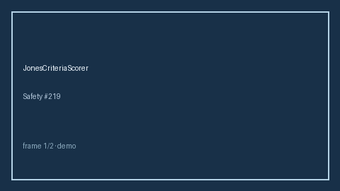

# JonesCriteriaScorer Guide



Research-only advisory scorer (Safety #219). Never modifies medications.

Gap vs MDCalc / AHA Jones criteria for acute rheumatic fever. Distinct from `CentorStrepPharyngitisScorer / HeartScoreAcsScorer`.

Optional polish via **GPT-5.5 / Claude Sonnet 4.6 / Gemini 3.x / Kimi K2**.

## Usage

```python
from medagent.safety.jones_criteria_scorer import (
    JonesCriteriaFactors,
    JonesCriteriaScorer,
)

findings = JonesCriteriaScorer().check(JonesCriteriaFactors())
assert "RESEARCH USE ONLY" in findings[0].rationale
print(findings[0].band, findings[0].score)
```

## Safety

RESEARCH USE ONLY. See `SAFETY.md`.
