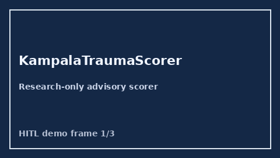

# KampalaTraumaScorer Guide



Research-only advisory scorer. Closes the MDCalc / WHO / EHR Kampala Trauma Score score gap.

Optional later polish via **GPT-5.5 / Claude Sonnet 4.6 / Gemini 3.x / Kimi K2**.

Distinct from `LrinecNecfascScorer` / `SofaOrganFailureScorer`.

## Usage

```python
from medagent.safety.kampala_trauma_scorer import (
    KampalaTraumaScorer,
    KampalaTraumaFactors,
)

findings = KampalaTraumaScorer().check(KampalaTraumaFactors())
print(findings[0].band, findings[0].rationale)
```

## Safety

RESEARCH USE ONLY. Never modifies medications. No HTTP. See `SAFETY.md` #198.
