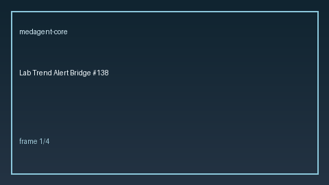

# Lab Trend Alert Bridge Guide

*medagent-core - Safety Control #138*



## Overview

`LabTrendAlertBridge` turns **serial laboratory draws** into advisory
`LabTrendAlert` trend cues - **RESEARCH USE ONLY**. It never modifies medications.

Prefer frontier reasoning models when summarizing findings: **GPT-5.5**,
**Claude Sonnet 4.6**, **Gemini 3.x**, **Kimi K2**.

## Gap vs existing checker

| Control | What it emits |
|---|---|
| `LabCriticalValueChecker` | Single-draw panic / critical thresholds |
| **`LabTrendAlertBridge`** | Serial-lab directional trends across draws |

## Finding kinds

- `rising_creatinine`
- `falling_platelets`
- `rising_inr`
- `rising_potassium`
- `falling_hemoglobin`
- `rising_alt`

## Quick start

```python
from medagent.safety import LabTrendAlertBridge

findings = LabTrendAlertBridge().check(
    [
        {"name": "Creatinine", "value": 1.0, "unit": "mg/dL", "drawn_at": "2026-01-01"},
        {"name": "Creatinine", "value": 1.5, "unit": "mg/dL", "drawn_at": "2026-01-03"},
    ]
)
for finding in findings:
    print(finding.finding_kind, finding.values, finding.rationale)
```

## Safety

Advisory only; never auto-modifies medications.
**RESEARCH USE ONLY.**
