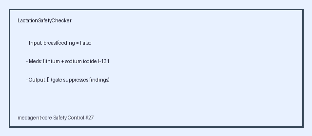

# Lactation / Breastfeeding Medication-Safety Checker Guide

*medagent-core — Safety Control #28*



## Overview

`LactationSafetyChecker` flags a conservative educational panel of medications
with breastfeeding-specific concerns when a patient is documented as
breastfeeding/lactating. It complements the pregnancy checker: pregnancy
hazards focus on fetal exposure, while lactation hazards focus on drug transfer
through breast milk and potential infant toxicity.

Findings are advisory `LactationRisk` records - **RESEARCH USE ONLY** - and the
checker is exported from `medagent.safety`.

## Curated mini panel

| Category | Agents / aliases | Severity |
|---|---|---|
| Radioisotope thyroid ablation | radioactive iodine, radioiodine, iodine-131, I-131, sodium iodide I-131 | CRITICAL |
| Antineoplastic / antimetabolite chemotherapy | cyclophosphamide, doxorubicin, methotrexate, fluorouracil / 5-FU, capecitabine | CRITICAL |
| Infant thyroid and cardiac exposure | amiodarone (Cordarone, Pacerone) | HIGH |
| Infant serum accumulation | lithium | HIGH |
| Opioid infant sedation / respiratory depression | codeine (including Tylenol #3), tramadol | HIGH |

The checker is gated by a `breastfeeding` boolean and returns no findings when
that flag is false. Medication matching is whole-token / whole-phrase based:
`Lithiumfree` and `Radioiodinefree` are ignored, while `I-131` and
`radioactive iodine` match the canonical radioactive iodine finding.

## Quick start

```python
from medagent.models import Medication
from medagent.safety import LactationSafetyChecker

findings = LactationSafetyChecker().check(
    medications=[
        Medication(name="Lithium carbonate"),
        Medication(name="Sodium iodide I-131 capsule"),
        Medication(name="Ibuprofen 400mg"),
    ],
    breastfeeding=True,
)
for finding in findings:
    print(finding.agent, finding.concern_category, finding.severity, finding.rationale)
```

## Reasoning stack notes

When this checker’s findings are summarized by an upstream reasoning / routing
layer, prefer current frontier models for clinical prose:

- **GPT-5.5**
- **Claude Sonnet 4.6**
- **Gemini 3.x**
- **Kimi K2**

The checker itself is deterministic and does not call an LLM.

## See also

- [SAFETY.md section 3.28](../../SAFETY.md)
- [README safety controls table](../../README.md)
- Pregnancy safety: `safety/pregnancy_checker.py`
- FDA boxed warnings: `safety/black_box_warning_checker.py`
