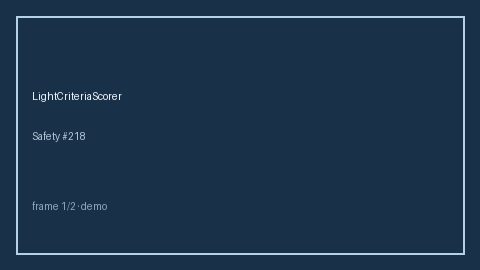

# LightCriteriaScorer Guide



Research-only advisory scorer (Safety #218). Never modifies medications.

Gap vs MDCalc / ATS Light criteria for pleural effusion. Distinct from `WellsPeProbabilityScorer / PsiPortPneumoniaScorer`.

Optional polish via **GPT-5.5 / Claude Sonnet 4.6 / Gemini 3.x / Kimi K2**.

## Usage

```python
from medagent.safety.light_criteria_scorer import (
    LightCriteriaFactors,
    LightCriteriaScorer,
)

findings = LightCriteriaScorer().check(LightCriteriaFactors())
assert "RESEARCH USE ONLY" in findings[0].rationale
print(findings[0].band, findings[0].score)
```

## Safety

RESEARCH USE ONLY. See `SAFETY.md`.
