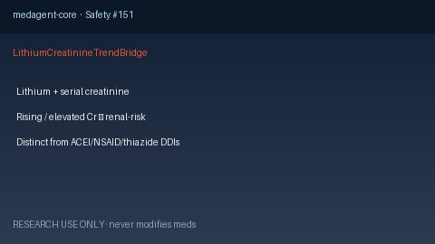

# Lithium Creatinine Trend Bridge Guide

*medagent-core — Safety Control #151*



## Overview

`LithiumCreatinineTrendBridge` combines **lithium** with serial **creatinine**
values showing a rise and/or an elevated level into advisory
`LithiumCreatinineTrendAlert` findings — **RESEARCH USE ONLY**. Never modifies
medications.

Prefer frontier reasoning models when summarizing findings: **GPT-5.5**,
**Claude Sonnet 4.6**, **Gemini 3.x**, **Kimi K2**.

## Gap vs related controls

| Control | What it requires |
|---|---|
| `LithiumAceiChecker` | Lithium + ACEI/ARB pairwise DDI |
| `LithiumNsaidChecker` | Lithium + NSAID pairwise DDI |
| `LithiumThiazideChecker` | Lithium + thiazide pairwise DDI |
| `LabTrendAlertBridge` | Rising creatinine only (drug-agnostic) |
| **`LithiumCreatinineTrendBridge`** | Lithium **plus** rising/elevated creatinine |

## Finding kinds

- `rising_creatinine_on_lithium` — rising creatinine while on lithium
- `elevated_creatinine_on_lithium` — creatinine ≥1.3 mg/dL while on lithium
- `lithium_renal_risk` — aggregate renal-risk advisory

## Quick start

```python
from medagent.models import Medication
from medagent.safety import LithiumCreatinineTrendBridge

findings = LithiumCreatinineTrendBridge().check(
    medications=[Medication(name="Lithium")],
    labs=[
        {"name": "creatinine", "value": 0.9, "drawn_at": "2026-01-01"},
        {"name": "creatinine", "value": 1.5, "drawn_at": "2026-01-08"},
    ],
)
for finding in findings:
    print(finding.finding_kind, finding.severity, finding.rationale)
```

## Safety

Advisory only; never auto-modifies medications.
**RESEARCH USE ONLY.** See `SAFETY.md` §3.151.
