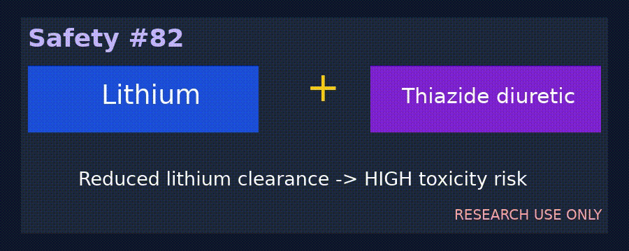

# Lithium + Thiazide Diuretic Checker Guide

*medagent-core — Safety Control #82*



## Overview

`LithiumThiazideChecker` flags lithium-class therapy co-prescribed
with hydrochlorothiazide/HCTZ, chlorthalidone, or indapamide. Thiazide
and thiazide-like diuretics can reduce renal lithium clearance, raise
serum concentrations, and cause toxicity.

Findings are advisory `LithiumThiazideRisk` records —
**RESEARCH USE ONLY** — with **HIGH** severity. The checker is exported
from `medagent.safety`.

## Medication panels

| Class | Agents |
|---|---|
| Lithium | lithium, Lithobid, Eskalith |
| Thiazide/thiazide-like diuretics | hydrochlorothiazide, HCTZ, chlorthalidone, indapamide |

Every unique lithium × supported thiazide pair across separate
medication entries yields one finding. Matching is whole-token based,
canonical pairs are de-duplicated, and output ordering is deterministic.

## Quick start

```python
from medagent.models import Medication
from medagent.safety import LithiumThiazideChecker

findings = LithiumThiazideChecker().check(
    [
        Medication(name="Lithium 300 mg BID"),
        Medication(name="Hydrochlorothiazide 25 mg daily"),
    ]
)
```

## Scope boundaries

This control is distinct from `LithiumNsaidChecker` and
`LithiumAceiChecker`. It does not replace serum lithium measurement,
renal-function assessment, or qualified clinical review, and never
changes therapy.

## Reasoning stack notes

When findings are summarized by an upstream reasoning/routing layer, prefer:

- **GPT-5.5**
- **Claude Sonnet 4.6**
- **Gemini 3.x**
- **Kimi K2**

The checker itself is deterministic and does not call an LLM.

## See also

- [SAFETY.md §3.82](../../SAFETY.md)
- [README safety controls table](../../README.md)
- Lithium + NSAID: `safety/lithium_nsaid_checker.py`
- Lithium + ACEI/ARB: `safety/lithium_acei_checker.py`
